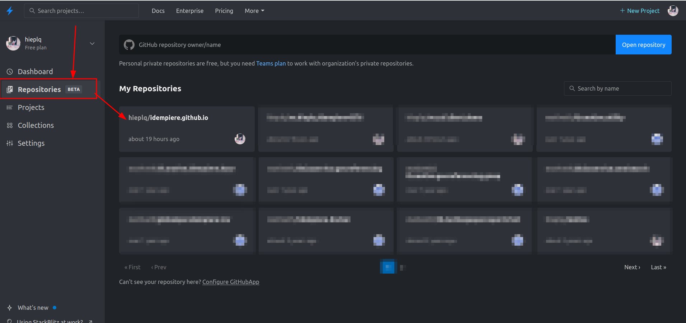
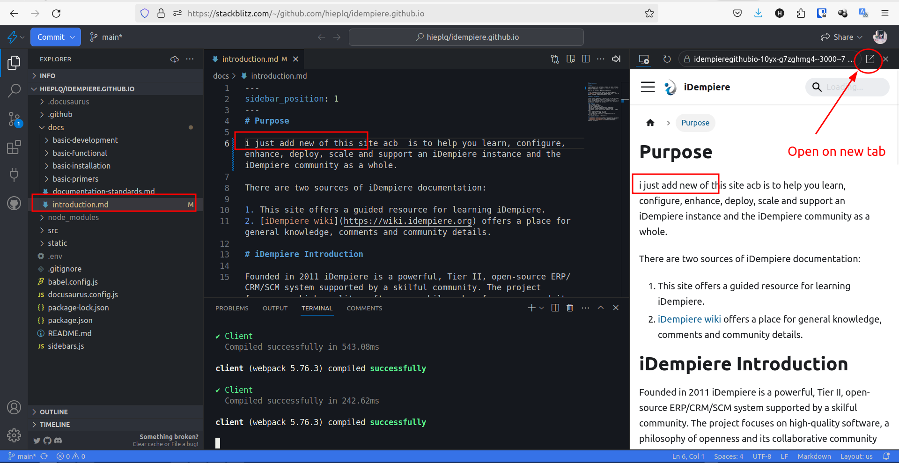
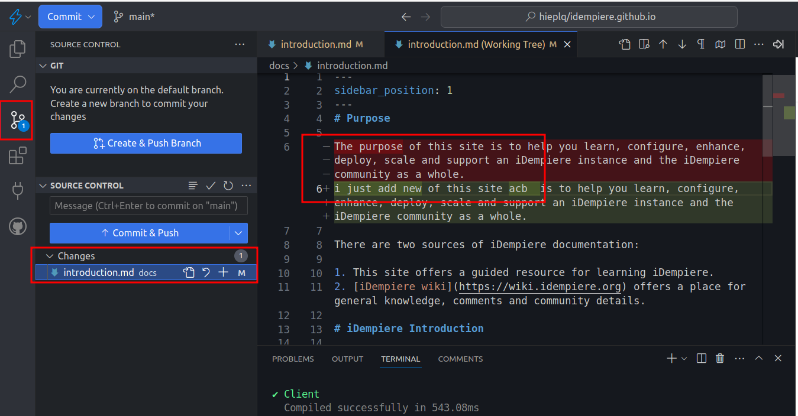

# iDempiere Documentation

This website is built using [Docusaurus 2](https://docusaurus.io/), a modern static website generator.

## Documentation Contribute

There are some ways to edit this site:

1. Through the github interface.
2. Through the source code at local.
3. Through the online service like Stackblitz

Since most users cannot directly commit to the repository, you will need to perform a pull request to perform edits. This process is quite easy when editing pages directly from the github web interface. Below is a description of how the process works in github.

If you wish to download and modify the source code, you will need to fork, modify and create a pull request. This process is discussed below.

## Github Interface

You are welcome to perform basic edits using the htts://github.com web interface. Here is a quick summary:

- Navigate to any given page (example: https://idempiere.github.io/docs/introduction)
- Click on the 'edit this page' link at the bottom of the page.
- Since most users cannot directly commit to the repository, github will guide you through

## Source Code At Local

If you wish to make and test local edits, use the following instructions:

```shell
# setup workspace, just do one time
sudo apt update
sudo apt install git
curl -o- https://raw.githubusercontent.com/nvm-sh/nvm/v0.39.1/install.sh | bash
source ~/.bashrc
nvm list-remote
nvm install v18.16.0
git clone https://github.com/idempiere/idempiere.github.io
cd idempiere.github.io/
npm install
```

Want to edit documents on "idempiere.github.io/docs" and see your changes instantly in the browser? Here's how:

1. Run``npm start``
2. Open the document in your preferred text editor. edit and save it

Now, any edits you make will be auto reflected live in the browser (without you need to do F5)!

## Online service like Stackblitz

1. To get started, open [StackBlitz](https://stackblitz.com/) and sign in using your GitHub account
2. Visit **repositories** and select 'idempiere.github.io'
   
3. StackBlitz offers a cloud-based Node.js development environment with a Visual Studio Code interface. This allows you to write and run Node.js without installing anything on your machine (actual it install to browse through [webcontainers](https://blog.stackblitz.com/posts/introducing-webcontainers/))
4. This feature allows for simultaneous document editing and live preview updates. You can even open the live preview in a separate browser tab
   
5. The tool also allows you to perform Git operations
   

## Internationalization and Translation

The purpose of this section is to offer a cheatsheet for adding an new locale and translations. Here are the details:

- Start with the[docusaurus internationalization introduction and 3 sub-pages](https://docusaurus.io/docs/i18n/introduction).
- Quick notes:
  - Modify docusaurus.config.js to include your[desired locale](https://saimana.com/list-of-country-locale-code/) (example: locales: ['en', 'fr', 'fa'],)
  - Run the command to write the translation details
    - npm run write-translations -- --locale es
  - Assuming you are manually translating your document (not using Crowdin), execute the mkdir/copy statements from here:
  - https://docusaurus.io/docs/i18n/git
  - Start translating...
  - Note: copying over the files to be translated is essentially like forking the documentation. It is recommended that you wait until the English docs are near-complete before copying over the content to minimize syncing efforts for future edits.

