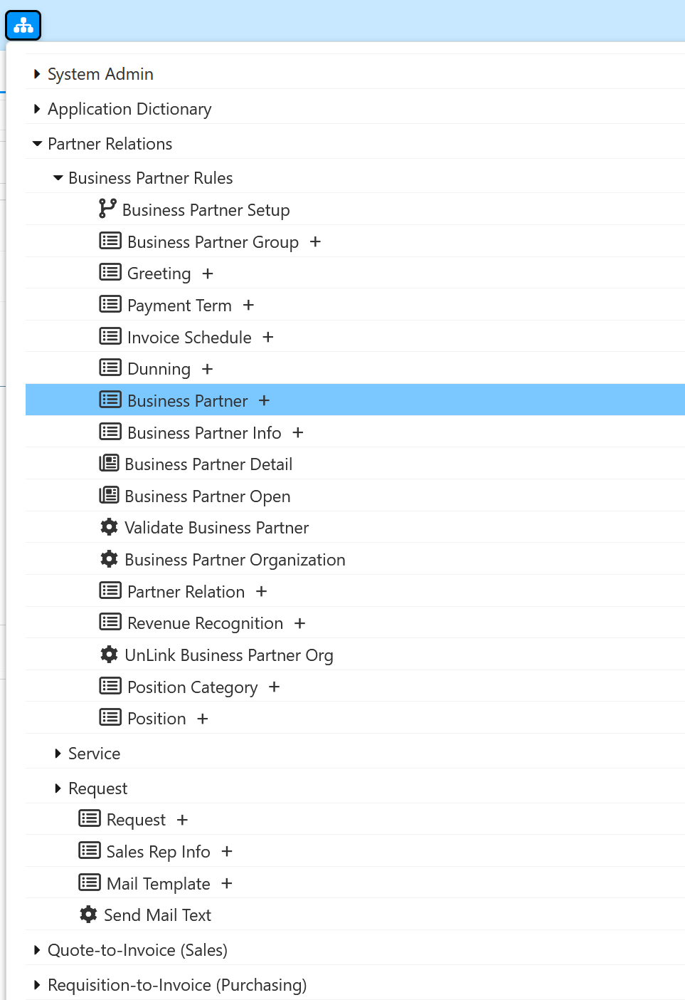
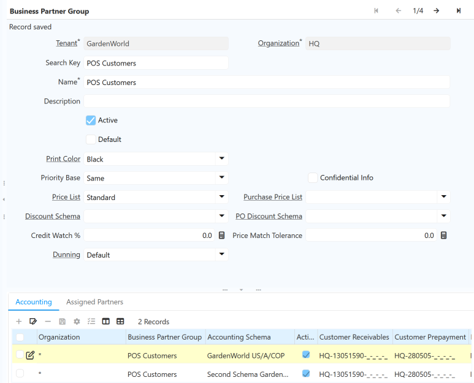

# Business Partner

## Introduction
Business Partner is the generic name for all the people/companies with a business
relationship with your tenant/client: that includes, vendors, customers, employes
and so on. Sometimes we need to configure groups, taxes and other specific
properties for invoicing or to manage them properly, so please be sure that you
understand the following capabilities for them

## Creating a Business Partner
The Business Partner window allows you to define any partner with
whom you perform transactions.  
There are different types of Business Partners, these include: Customers, Vendor or
Suppliers, Employees and Sales Representatives each one of these represent a
different role and function within the company.
Menue: **Partner Relations -> Business Partner Rules -> Business Partner **  

## Customers

### Introduction

A customer is a subject or entity that accesses resources, products or services
provided by another. For business, the customer is the individual who, through a
financial transaction, acquires a product and / or
service of any kind (technological, gastronomic, decorative, furniture or property,
etc.). A customer is synonymous with a buyer or consumer.
A customer corresponds to a business partner with whom the company makes
sales transactions and of which special information such as account statements,
credit quota, discounts granted, price list, among others are needed. In
iDempiere, the qualification of the Customer is granted to a business
partner created, for which you will see that the windows and the concepts will
always refer to the Business Partner. The above means that a Business Partner can
be marked as a customer and in turn as an employee and as a vendor (supplier).

### Business Partner Group

The Customers are created first instance as business partners and selecting the
Customer field. A business partner group must be assigned to the registry.
Menu: **Partner Relations –> Business Partner Rules -> Business Partner Group**
In iDempiere it is possible to group the business partner by similar
characteristics through this group option of third parties, either to generate reports
or carry out massive processes such as changes in accounting
accounts, price lists and discounts.
You can create N groups of business partners in iDempiere for example:
PARTNERS, VIP CLIENTS,INTERNAL CLIENTS, STAR SUPPLIERS ..
As an example, the following Customer registry is created:

List example:
- a 
- b

1 ddd
2 ggg

## Outlook

Perhaps some remarks on relationships to prices, marketing, services and requests as important relationships for business partner data.
