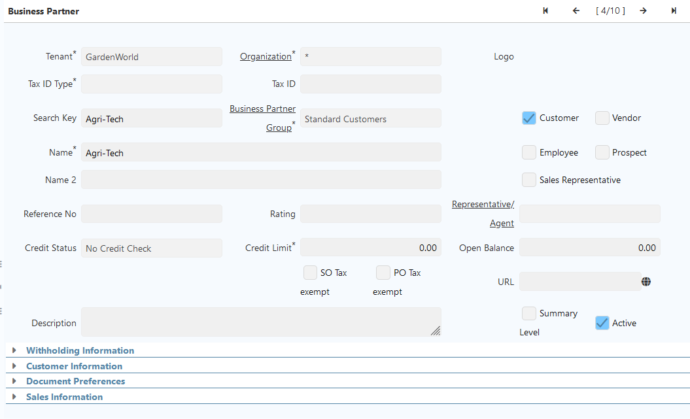

# Business Partner

## Introduction
Business Partner is the generic name for all the people/companies with a business
relationship with your tenant/client: that includes, vendors, customers, employees
and so on. Sometimes we need to configure groups, taxes and other specific
properties for invoicing or to manage them properly, so please be sure that you
understand the following capabilities for them

## Creating a Business Partner
The Business Partner window allows you to define any partner with
whom you perform transactions.  
There are different types of Business Partners, these include: Customers, Vendor or
Suppliers, Employees and Sales Representatives each one of these represent a
different role and function within the company.
Menu: **Partner Relations -> Business Partner Rules -> Business Partner **  

## Customers

### Introduction

A customer is a subject or entity that accesses resources, products or services
provided by another. For business, the customer is the individual who, through a
financial transaction, acquires a product and / or
service of any kind (technological, gastronomic, decorative, furniture or property,
etc.). A customer is synonymous with a buyer or consumer.
A customer corresponds to a business partner with whom the company makes
sales transactions and of which special information such as account statements,
credit quota, discounts granted, price list, among others are needed. In
iDempiere, the qualification of the Customer is granted to a business
partner created, for which you will see that the windows and the concepts will
always refer to the Business Partner. The above means that a Business Partner can
be marked as a customer and in turn as an employee and as a vendor (supplier).

### Business Partner Group

The Customers are created first instance as business partners and selecting the
Customer field. A business partner group must be assigned to the registry.
Menu: **Partner Relations –> Business Partner Rules -> Business Partner Group**
In iDempiere it is possible to group the business partner by similar
characteristics through this group option of third parties, either to generate reports
or carry out massive processes such as changes in accounting
accounts, price lists and discounts.
You can create N groups of business partners in iDempiere for example:
PARTNERS, VIP CUSTOMERS,INTERNAL CUSTOMERS, STAR SUPPLIERS ..
As an example, the following Customer registry is created:

### Configuration of a Customer

In the following window you will see a sample all fields are required

The marked Customer checkbox (on the right side) is necessary, then you will see new Sections and Tabs appear on the screen related to the customer functionality.

Essential Fields for Customer: Name, Business Partner Group.

Additional fields (not mandatory) with impact on sales are:
a) Section *Customer Information*

**Invoice Rule**: The Invoice Rule defines how a Business Partner is invoiced and the
frequency of invoicing.  
**Invoice Schedule**: The Invoice Schedule identifies the frequency used when
generating invoices.  
**Payment Rule**: The Payment Rule indicates the method of invoice payment.  
**Payment Term**: Payment Terms identify the method and timing of payment.  
**Delivery Rule**: The Delivery Rule indicates when an order should be delivered. For example should the order be delivered when the entire order is complete, when a line is complete or as the products become available.  
**Delivery Via**: The Delivery Via indicates how the products should be delivered. For example, will the order be picked up or shipped.  
**Price List**: Price Lists are used to determine the pricing, margin and cost of items purchased or sold.  
**Discount Schema**: After calculation of the (standard) price, the trade discount percentage is calculated and
applied resulting in the final price.  
**Flat Discount %**: Flat discount percentage   
**Dunning**: To determine times and schedule for creating dunning notes to the customer if he has open invoices.   

b) Section *Document Preferences* 

In this section there are some preferences to configure the language for documents, the greeting used, the invoice print format, number of copies for the documents and some reference information. 

c) Section *Sales Information*  

This gives direct access to information on business with the customer. 

- a 
- b

1 ddd
2 ggg

## Outlook

Perhaps some remarks on relationships to prices, marketing, services and requests as important relationships for business partner data.

## Note
Some parts of this text are adapted from materials created by Pedro Rozo and SmartJSP, shared under the GNU General Public License. Used with permission for this project.
