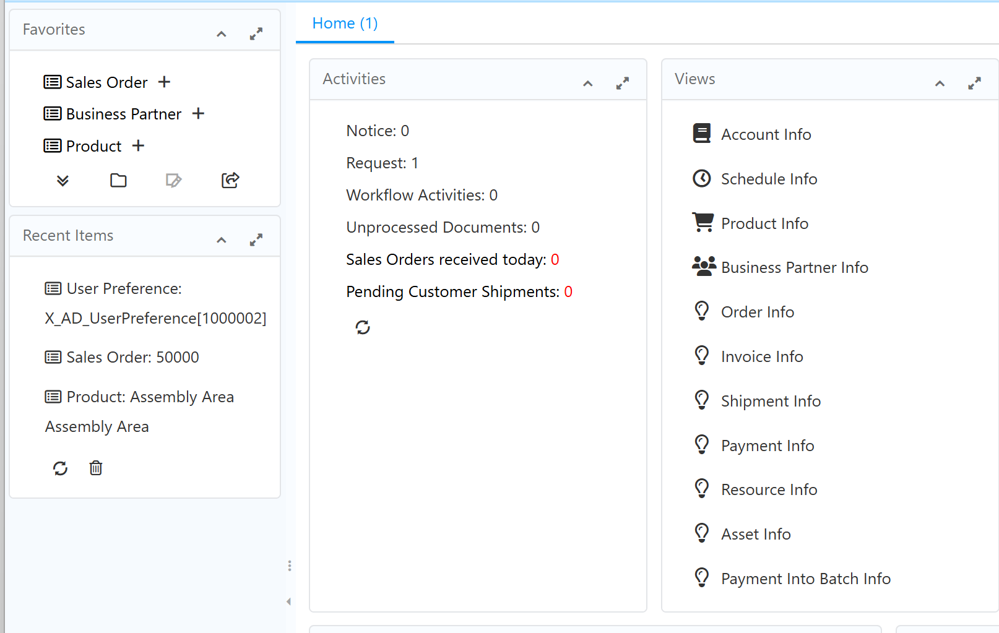
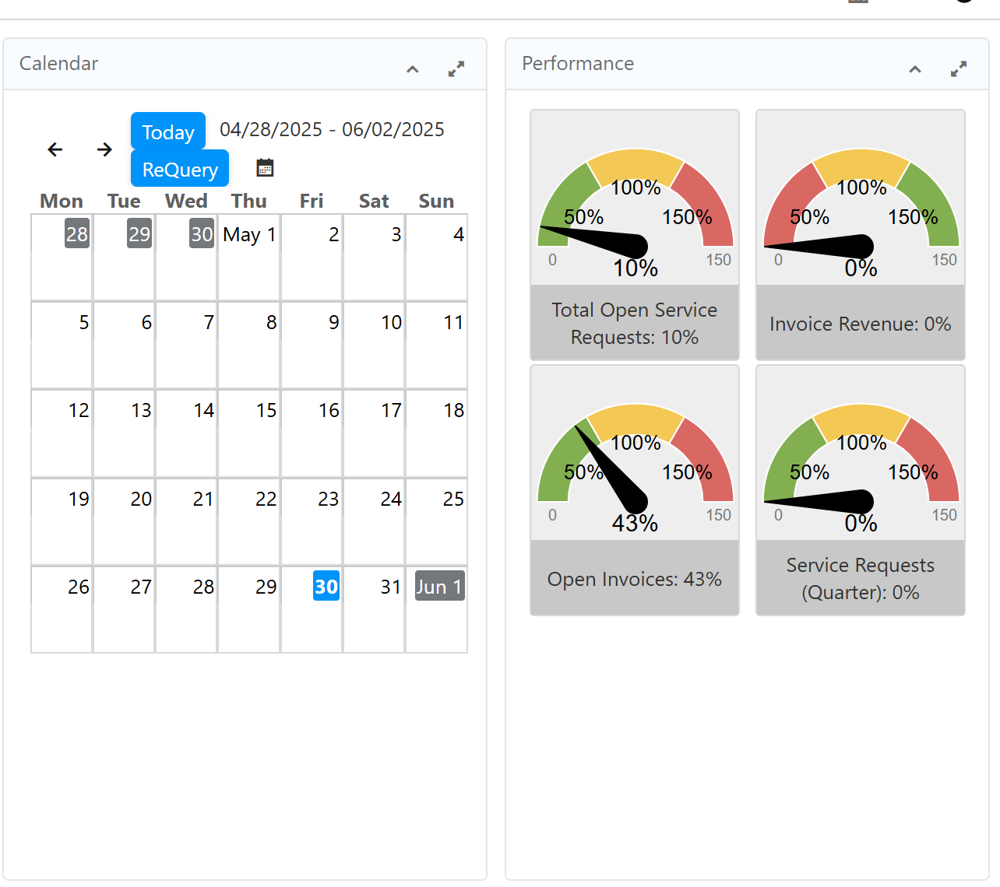
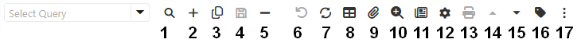

# Window handling  (still open work )
Navigation in Idempiere is one of the great benefits that it offers since its interface is very
friendly, it allows configuration in multiple languages and when placing the mouse pointer
on each of its icons or buttons, it clearly shows the name and/or role it plays. To enter the
system you may use any browser (Chrome, Firefox, Explorer ...) by entering the URL
provided. For optimum performance navigating the system with Google Chrome.

# Components of iDempiere Window

Some important areas are:
- Favorites
- Recent items
- Activities
- Views
not seen above further right are
- Calendar
- Performance (Dashboard)
- Help (optionally displayable)

# Favorites
The favorites are usere specific. In this view you can add processes and / or documents to which you can access
more frequently, gaining time and accessing more quickly. You can also remove them
using the delete icon.
You can define new favorites just by dragging & dropping the items (using your mouse)
from the menu to this area.

# Recent items
In this view you can see the processes or documents made by the
logged-in user. In the same way they can be deleted with the delete icon.
The information in Idempiere is stored and registered through windows, these are used to
store for example: Business Partner information, products, general accounting and other
data of high importance for the company.

# Activities
Here you can quickly observe and enter processes or workflows. Some of them
are: notice, request, workflows and raw documents.

# Views
Here you can see the direct links to the most frequent info windows, among them
Business Partner and others. Info windows are quick ways to access crucial data from the ERP-system.

# Calendar
The calendar will be used to display important dates for the user which must before defined in the respective business activities e.g. the usage of resources.

# Performance (Dashboard)
Here you see computed values in graphical displays of important business data. They usually are tailored for each company and often for single user groups.

There are different types of windows you can access from the menue, a) data entry and display b) report c) jobs d) info

Most important are data entry and display windows.

# Main items and functions in data and order entry windows

1. Lookup Record
2. New Record
3. Copy Record (from current one)
4. Save Record
5. Delete Record
6. Undo action
7. Requery / Refresh
8. Grid toggle
9. Attachment
10. Zoom across (cross references associated records/documents)
11. Report
12. Process (advanced actions if available)
13. Print
14. Back to parent record
15. Navigate to detail record
16. Label for dataset
17. More options:

## L...
To enter t....

