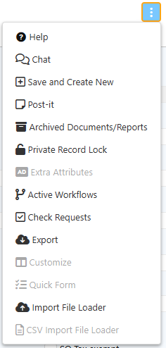

# Window handling 
Navigation in iDempiere is one of the great benefits that it offers since its interface is very
friendly, it allows configuration in multiple languages and when placing the mouse pointer
on each of its icons or buttons, it clearly shows the name and/or role it plays. To enter the
system you may use any browser (Chrome, Firefox, Safari ...) by entering the URL
provided.

# Components of iDempiere Window

Some important areas are:
- Favorites
- Recent items
- Activities
- Views
not seen above further right are
- Calendar
- Performance (Dashboard)
- Help / Quick Info area (optionally displayable)

# Favorites
The favorites are user specific. In this view you can add processes and / or documents to which you can access
more frequently, gaining time and accessing more quickly. You can also remove them
using the delete icon.
You can define new favorites just by dragging & dropping the items (using your mouse)
from the menu to this area.  For a better organization, favorites can be ordered like a tree within folders, and with the "Automatic Launch" button you can define options that are automatically opened when you start a session.

# Recent items
In this view you can see the records or documents that were recently modified by the
logged-in user. In the same way they can be deleted dragging and dropping the recent item into delete icon.
:::tip
You can add a record to the Recent Items by editing a field of the record and then canceling the edition.
:::

# Activities
Here you can quickly review some statistics number configured in your system.  They are shown as a title and a number indicating the number of records that are present in this type of activity.  Some of them
are: Notice, Request, Workflow Activities and Unprocessed Documents.  This list be different vary depending on your role and the configuration of your system.

# Views
Here you can see the direct links to the most frequent info windows, among them
Business Partner and others. Info windows are quick ways to access crucial data from the ERP-system.

# Calendar
The calendar can be used to display important dates for the user which must be defined in the respective business activities using the Requests feature.

# Performance (Dashboard)
Here you can see computed values in graphical charts of important business data. They usually are tailored for each company and often for single user groups.

There are different types of windows you can access from the menu, a) Windows for data entry and display b) Report c) Processed d) Info Windows

Most important are data entry and display windows.

# Main items and functions in data and order entry windows

1. Lookup Record  
Can be used to search records specifying some criteria, if there are Saved Queries, the list will be shown in the "Select Query" box before the button.
2. New Record
3. Copy Record (from current one)  
    Will copy the current record, but only the contents of the directly visible main table elements. Other tabs containing detailed contents of the object will not be copied (e.g. copy of a product will not copy the prices.) To accomplish this, other dedicated functions are required. 
4. Save Record
5. Delete Record  
Warning!  This action is irreversible
6. Undo action
You can undo edits that have not been saved yet to the database.
7. Requery / Refresh  
The information that you see on the screen could have been changed by another user, or by a process executed.  This button forces a read from the database to see the most fresh information in case that happened.
8. Grid toggle  
This button allows to switch between the mono-record and multi-record views
9. Attachment  
Any record can manage attached files using this button.
10. Zoom across (cross references associated records/documents)  
Clicking this button shows a list of related records on other windows.  Better to be used with care as this option can be expensive and time consuming.
11. Report  
This button allows to generate reports from the record or records selected, these are usually tabular reports in HTML, PDF, CSV or Spreadsheet formats
12. Process (advanced actions if available)  
Some records allow to run associated process (for example copying the lines of an order), you can find additional processes in this "Gear" button.
13. Print  
Some documents have a printable format designed, you can generate those formats with this button.
14. Back to parent record
15. Navigate to detail record
16. Label / Tag  
This allows to define and see Labels or Tags associated to the current record.
17. More options:

# More options (for functions in data and order entry windows

The diverse functions to be accessed through "More options" can be moved by the system administrator to the main row of functions directly visible.

1. Help  
It opens a new tab showing information about the tabs and fields composing the current window.
2. Chat  
This option allows to record comments or additional information related to the record on screen.  The comments can be threaded, they cannot be deleted, and they have the information of the user and time when they were added.
3. Save and Create New  
This option is the shortcut equivalent to clicking the "Save" button and then the "New" button
4. Post-it  
It allows to set one comment or additional information for the current record, this comment can be edited/deleted.
5. Archived Documents/Reports  
When the user is looking for a tabular report or a document print format the PDF can be archived, with this button you can see if there are related documents archived.
6. Private Record Lock  
This option allows to restrict the access (if the user has permission to), it can be restricted per role, or a record can be made private (just the current user can see it)
7. Extra Attributes  
Some windows can request additional information configured with this button (like additional fields).
8. Active Workflows  
Here the user can navigate to check the workflows generated by the current document or record.
9. Check Requests  
If there are requests associated to the current record they can be navigated with this button, also the user can decide to create a new request from here.
10. Export  
This option allows to export the current record or the selected records in different formats, like CSV, Spreadsheet ZIP.
11. Customize  
This option allows the user to customize the fields shown in the grid view, as well as the width of the fields, and define if the tab must be opened by default in grid mode.
12. Quick Form  
Some tabs (for example Sales Order Lines) allows to enter information in a grid mode using just the keyboard (no need for mouse).  This button opens such quick form.
13. Import File Loader  
Some advanced roles can import CSV files directly into the tab, this option allows to import arbitrary CSV files (following certain column naming conventions).
14. CSV Import File Loader  
This button is shown when there is a predefined CSV configuration for the current tab.  The user can then import multiple records in one step.

The above functions are partially self explaining, like New Record. But others have different behavior compared to a function in Word or Excel (e.g. Copy Record).  
**These explanations are still open work and will be extended in future!**
