---

title: Setup for automated tests with Fitnesse
authors: [tester, fwol]
tags: [docusaurus, test, idempiere]
---

**Table of Content**

import TOCInline from '@theme/TOCInline';

<TOCInline toc={toc} />

**Goal: **  Functional Testing

**Sponsor: ** [Sponsor:Trek_Global|Trek Global](https://wiki.idempiere.org/en/Sponsor:Trek_Global)

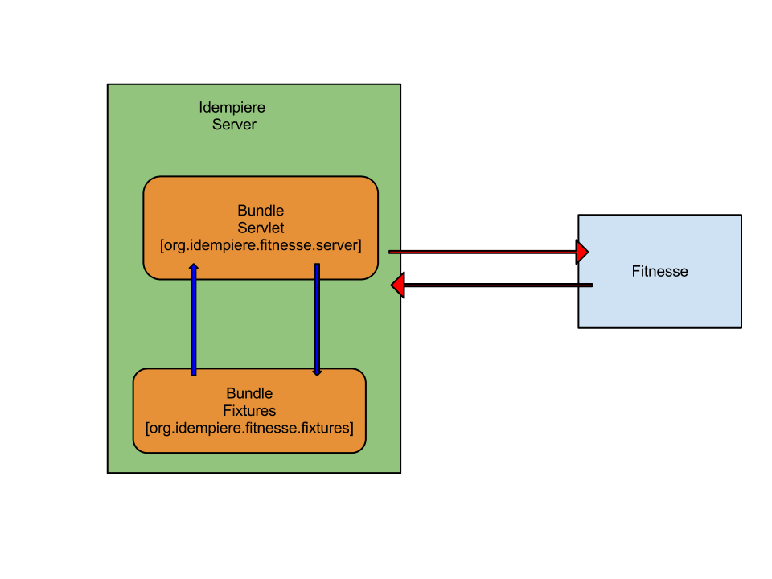

## Description:

Allow user and developer create and execute fitnesse tests withing the idempiere environment. 

**_Please, be aware that this documentation has changed significantly from earlier versions to iDempiere Vers. 10._**

Two different cases can be distinguished:

- Running fitnesse from eclipse
- Running fitnesse on a server from comand line

## Running fitnesse from eclipse {#running_fitnesse_from_eclipse}

-   Prerequisiste is an installed development environment.
-   Get the \"fitnesse\" java project which fits to your release into
    your eclipse workspace. You will find the sources on github.
    <https://github.com/idempiere/idempiere-fitnesse>
-   following folder structure is necessary for iDempiere Dev and the
    fitnesse part (github standards must be renamed!):
    -   idempiere
    -   idempiere-fitnesse
        -   org.idempiere.fitnesse.\*
        -   org.idempiere.fitrecorder
        -   org.idempiere.ui.zk.selenium
-   Before importing the Fitnesse-plugin into the iDempiere Workspace
    you must run "mvn verify" in the idempiere-fitnesse folder !
    -   To avoid Tycho/Maven problems, remove
        \~/.m2/repository/.meta/p2-artifacts.properties prior to running
        maven build for source using Tycho 2.6 and below, i.e. with: rm
        \~/.m2/repository/.meta/p2-artifacts.properties (rm \~ is
        helpful cause the file is difficult to find otherwise)
-   Import - Existing Projects into Workspace + there tick "Search for
    nested Projects" (see image below)
-   Set ADEMPIERE_WEB_PORT StringSubstitution to right Port with SSL
    e.g. 8443 (older versions work with 8080)
    -   The value is set in Eclipse - Preferences - Run/Debug - String
        Substitution
    -   The former port mentioned in older and following screenshots
        does not work anymore as SSL is mandatory for iDempiere.
    -   Use 8443 or your selected SSL-Port for iDempiere Access in setup
        for String Substitution !!!:

## Run IDempiere Fitnesse Bundles {#run_idempiere_fitnesse_bundles}

-   First you have to define the Fitnesse Application in the Eclipse -
    Configurations

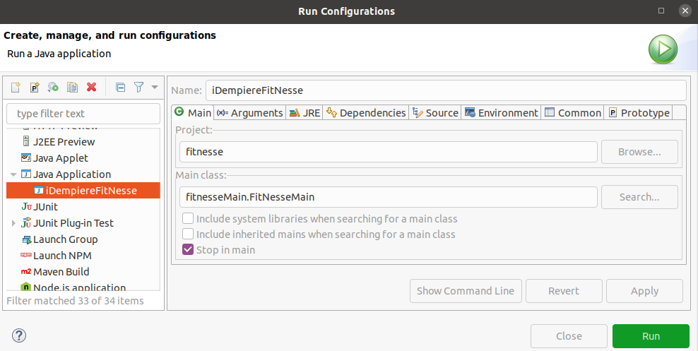

-   Use \"Run\" for starting the fitnesse component. Debug was required
    in older versions.
-   Verify fitnesse started ok.

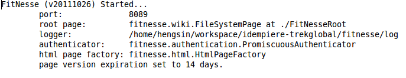

-   Please start the bundles at the idempiere server\'s osgi as shown
    below in the screenshot:

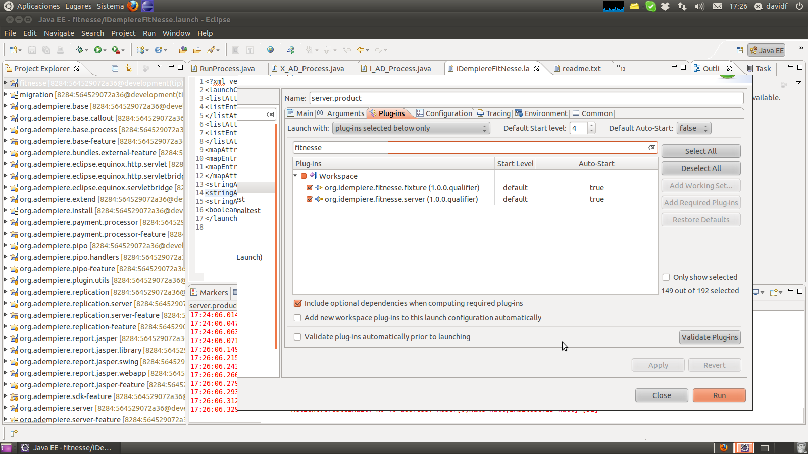

### Run IDempiere Fitnesse Bundles {#run_idempiere_fitnesse_bundles_1}

Congratulations finished! Now you can start using Fitnesse with
iDempiere e.g. start some of the TestCases already prepared for Login or
a new Business partner.

Some special cases are:

-   If your server is running with a self-signed certificate, you must
    match the certificates in the respective cacert and key.pem. You
    find some commands to do this on one computer containing both
    iDempiere and Fitnesse-server below: [Installing
    Fitnesse.HowTo#Allow SSL-Connection for self signed
    certificates](Installing_Fitnesse.HowTo#Allow_SSL-Connection_for_self_signed_certificates_: "wikilink")

-   Sometimes you must start the fitnesse OSGI-bundles by hand the first
    time they are used:
    1.  find out the numbers of the OSGI-plugins and then
    2.  start the plugins for fitnesse (those before set to auto start)
        (compare comands on OSGI console below:)

1\. On eclipse console write :

osgi> `ss`

Look for idempiere services, for example:

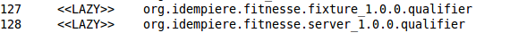

2\. And start the services related:

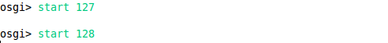

-   After that normally they will start automatically.

## Running IDempiere Fitnesse server From Command Line {#running_idempiere_fitnesse_server_from_command_line}

You can also set up Fitnesse on any server e.g. on a normal test, other
iDempiere server or even access iDempiere on another system.

For this you need to do in preparation:

-   Build the Fitnesse for server from github
-   Ensure you have SSL-connection between the Fitnesse and the
    iDempiere server (with public certificates this works out of the
    box. Another option for private keys will be outlined below).

### Build Fitnesse from github {#build_fitnesse_from_github}

-   Basic setup also in idempiere and idempiere-fitnesse folders
    directly on top of user's home (for links and folders see
    description on Dev)
    -   Get the \"fitnesse\" java project which fits to your release
        into your eclipse workspace.
        https://github.com/idempiere/idempiere-fitnesse
    -   following folder structure is necessary for iDempiere Dev and
        the fitnesse part (github standards must be renamed!):
        -   idempiere
        -   idempiere-fitnesse
    -   You must run "mvn verify" in both folders
        1.  idempiere
        2.  idempiere-fitnesse
    -   To avoid Tycho/Maven problems, remember to remove
        \~/.m2/repository/.meta/p2-artifacts.properties prior to running
        maven build, i.e. with: rm
        \~/.m2/repository/.meta/p2-artifacts.properties
-   Then the server is changed to a running iDempiere-server in the
    folder "idempiere" (perhaps other options are easier??)

-   command in fitnesse path:
    -   ant build (ant must be installed before)
-   Now move the parameters from the iDempiere-server to the
    Fitnesse-server
    -   Copy deploy-fitnesse.sh (from idempiere-fitnesse) to main path
        of iDempiere-server
    -   Execute deploy.sh and direct the output to
        \.../org.idempiere.fitnesse.p2/target/repository e.g.
        ./deploy-fitnesse.sh
        <file:/home/idempiere/idempiere-fitnesse/org.idempiere.fitnesse.p2/target/repository>

If your server is running with self-signed certificates, please, you
must match the certificates in the respective cacert and key.pem. You
find some commands to do this on one computer containing both iDempiere
and Fitnesse-server below: [Installing Fitnesse.HowTo#Allow
SSL-Connection for self signed
certificates](Installing_Fitnesse.HowTo#Allow_SSL-Connection_for_self_signed_certificates_: "wikilink")

### Start fitnesse server from command line {#start_fitnesse_server_from_command_line}

-   The script run.sh sets the variable ADEMPIERE_WEB_PORT based on a
    file idempiereEnv.properties located on the folder above
    fitnesse_home
    -   In case the properties file is not copied automatically by the
        deploy.sh, copy it from idempiere-Folder to
        idempiere-fitnesse-Folder manually
    -   Anycase make sure that the contents of the file for
        ADEMPIERE_WEB_PORT-Parameter (from Version 10 with SSL
        prescribed) is ADEMPIERE_WEB_PORT=8443

-   Open a Terminal and go to Idempiere Fitnesse Location in your
    Computer (\.... idempiere-fitnesse/fitnesse)
-   Start Fitnesse executing: ./run.sh

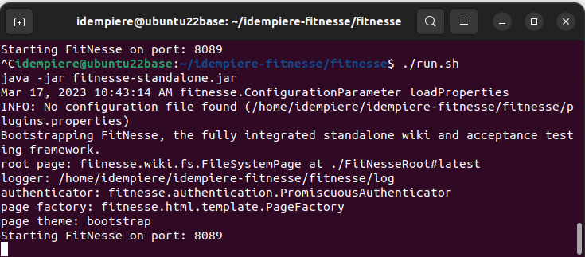
   
-   In the iDempiere-Server you must also start the OSGI-bundles for
    -   org.idempiere.fitnesse.fixture \... and
    -   org.idempiere.fitnesse.server (details for a start via telnet
        you find below)

## Running Bundles From Demo Idempiere {#running_bundles_from_demo_idempiere}

-   Go to idempiere demo and connect.

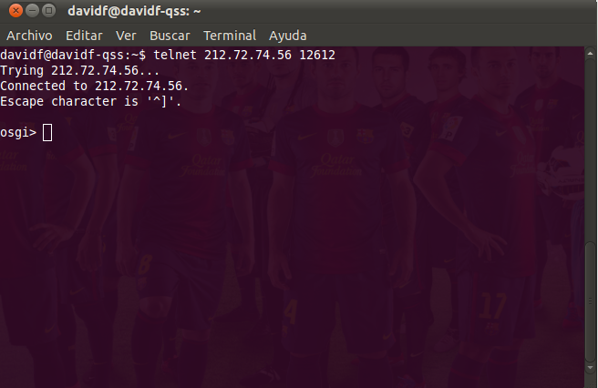

-   To Install bundles in idempiere demo in the console type this:

` install `[`http://jenkins.idempiere.com/job/iDempiereDaily/ws/buckminster.output/org.adempiere.server_2.0.0-eclipse.feature/site.p2/plugins/org.idempiere.fitnesse.fixture_2.0.0.v20140610-0232.jar`](http://jenkins.idempiere.com/job/iDempiereDaily/ws/buckminster.output/org.adempiere.server_2.0.0-eclipse.feature/site.p2/plugins/org.idempiere.fitnesse.fixture_2.0.0.v20140610-0232.jar)

` install `[`http://jenkins.idempiere.com/job/iDempiereDaily/ws/buckminster.output/org.adempiere.server_2.0.0-eclipse.feature/site.p2/plugins/org.idempiere.fitnesse.server_2.0.0.v20140610-0232.jar`](http://jenkins.idempiere.com/job/iDempiereDaily/ws/buckminster.output/org.adempiere.server_2.0.0-eclipse.feature/site.p2/plugins/org.idempiere.fitnesse.server_2.0.0.v20140610-0232.jar)

-   You must start the services

osgi> `ss`

-   Look for idempiere services, for example:

-   And start the services related:

## Allow SSL-Connection for self signed certificates {#allow_ssl_connection_for_self_signed_certificates}

Outline of procedure - there are other options for ssl and cacerts
handling experts.

In iDempiere-setup (1^st/first field in Keystore window) computer must be
named "localhost" (, otherwise name of computer same as alias)

-   Commands to be execuded in folder \.../fitnesse-server/fitnesse
    (Command after bullet, comment next line in brackets):
    -   rm cacerts (other cacert inherited from the repository in
        Github)
    -   cp /etc/ssl/certs/java/cacerts . (Copy of certifikate from
        computer(iDempiere-web-server) to fitnesse (command incl. \".\")
    -   keytool -list -v -keystore cacerts (for inspection - Standard
        \'no password\' or \"changeit\" or \"your password\" !best )
    -   echo \| openssl s_client -connect localhost:8443 2\>&1 \| sed
        -ne \'/-BEGIN CERTIFICATE-/,/-END CERTIFICATE-/p\'\> key.pem
        (Please note: For this your iDempiere server (to be connected to
        fitnesse) must run)
    -   keytool -import -alias localhostnew -file key.pem -keystore
        cacerts (if import is done serval times localhost must change
        name, e.g. localhostN with N=1,2,\... so simply numbering the
        term)

## Edit global setting {#edit_global_setting}

You must edit global setting

-   In your browser type <http://localhost:8089/> (With the port you
    already configure in this case 8089)
-   Go to root

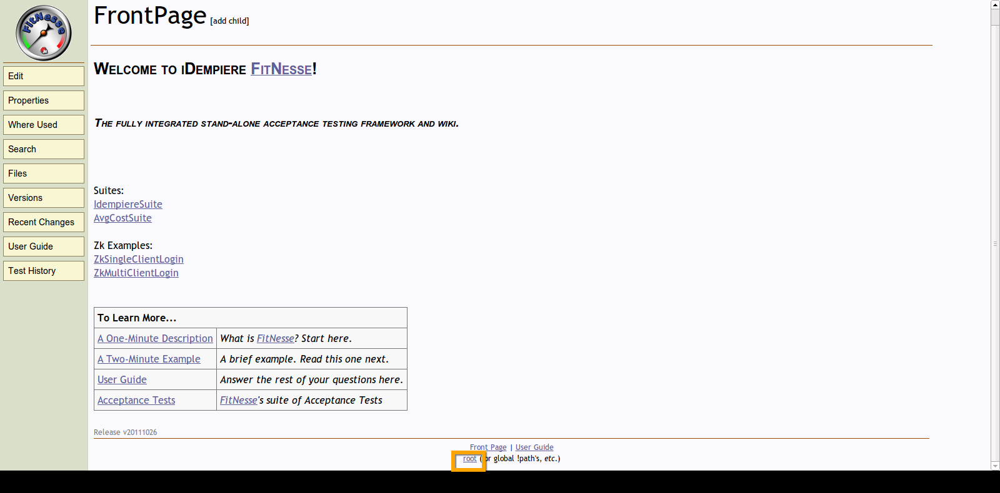

-   Write your own workspace location here
-   Change for the same Port as you run idempiere in this case 8089

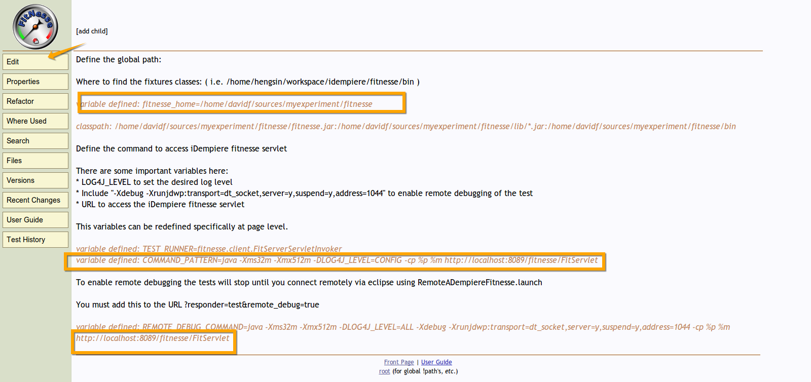

## More screenshots {#more_screenshots}

-   The following are the screenshots of the tests layout that you can
    find when you click on the items above.

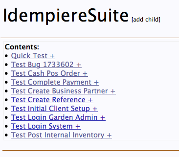
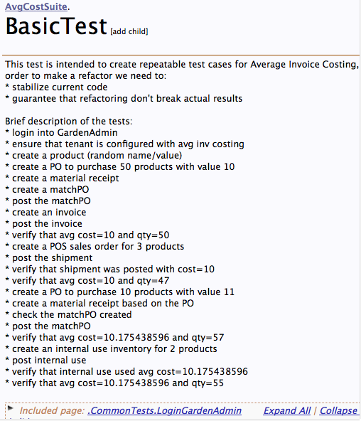
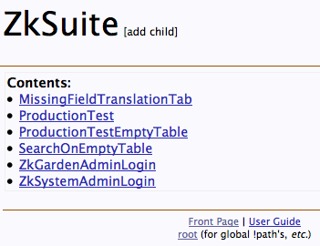

## See Also {#see_also}

Still open how to handle thes links inside the wiki or to outside in docusaurus:

	-   [NF001_Fitnesse_Integration](NF001_Fitnesse_Integration "wikilink")
	-   [Free PDF book describing in more
	    detail](http://red1.org/iDempiereFitNesse.pdf)

	[en:Fitnesse.HowTo](en:Fitnesse.HowTo "wikilink")
	[es:Fitnesse.HowTo](es:Fitnesse.HowTo "wikilink")
	
	[U](Category:Fitnesse "wikilink") [Category:Functional
	Testing](Category:Functional_Testing "wikilink")
	[Category:Development‏‎](Category:Development‏‎ "wikilink")
	[Category:Developer
	documentation‏‎](Category:Developer_documentation‏‎ "wikilink")
	[Category:HowTo-Technical](Category:HowTo-Technical "wikilink")

--------------------------------------------------------------------------
_End of Document_

