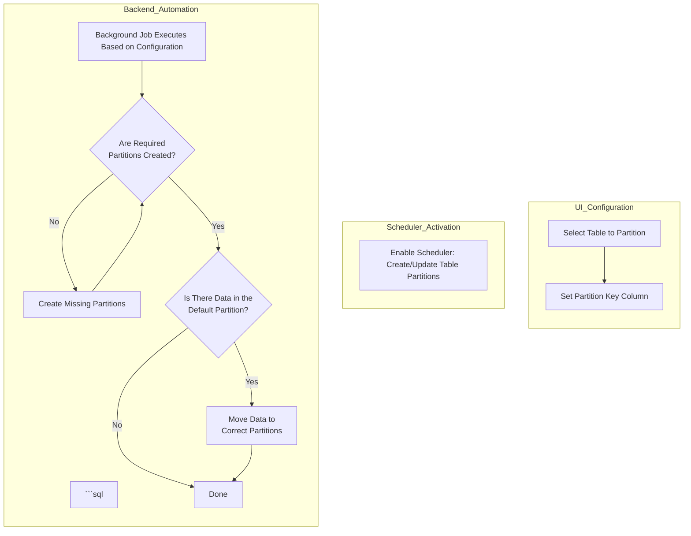

**Goal:** Technical

**Initial idea, sponsorship:** Norbert Bede, Cloudempiere

**Developers**: Hengsin, Elaine Tan

**Feature** **Ticket: [IDEMPIERE-5943](https://idempiere.atlassian.net/browse/IDEMPIERE-5943)**

**Description:** Table partitioning support for PostgreSQL and Oracle

- Support partition by List and Range
- Support partition of new and existing table
- Support moving of data and constraints from existing table to partitioned table (For PostgreSQL only)
- Support auto addition of new partition through scheduled process

**Not cover:**

- List/range partitioning for more than one partition key
- Sub-partition (This has been implemented by [IDEMPIERE-5963](https://idempiere.atlassian.net/browse/IDEMPIERE-5963))

## Configuration
Configure the partition information at **Table and Column** window

### Table
***Partition:** Indicates this is a partitioned table
***Create/update partition:** Process which create or update table partitions based on the information in the table and column records


_AD_ChangeLog_


_AD_Session_

### Column
***Partition Key:** Indicates this is a partition key
***Partition Key Sequence:** Indicates the order of the partition keys where the lowest number comes first
***Partitioning Method:** Indicates how the Table is partitioned (List or Range)
    - List partitioning - The data distribution is defined by a discrete list of values
    - Range Partitioning - The data is distributed based on a range of values
***Range Partition Interval:** Indicates the interval used in a range partitioning (date or number)
    - Examples of date intervals: 1 year; 6 months;
    - Examples of number intervals: 5000; 100000;


_List Partitioning_


_Range Partitioning_

## Execution of the process
The process can be called from the **Table and Column** window or **Menu**

### Table and Column window
The process can be called from the **Create/update partition** button on the **Table and Column** window.


### Menu
The process can be called from the **Create/Update Table Partition** menu item. The **Partitioning Method** and **Table Name** parameters are optional. By default, the process will execute the process for all partitioned table records (i.e. Table > Partition = Yes)

- **Partitioning Method:** The partitioning method of the table
- **Table Name:** This is a table name, or a LIKE clause (e.g. AD_%)


## View the table partition info
Read-only. Capture the database partition info from the database to the **Table Partition** table (i.e. AD_TablePartition). Each **Table Partition** record represents an actual database partition

***Name:** The name of the partition
***Expression:** SQL clause of the partition


## Scheduler
- A scheduler process called **Create/Update Table Partitions** is created to run the **Create/update partition** process daily. This is default to inactive and is for implementation to activate it and select the appropriate interval and timing for a particular instance.
- For Oracle, the scheduled process will read auto created partition details from DB and update the X_AD_TablePartition table.
- For PostgreSQL, the scheduled process will process new records that goes into default partition, create new partition for those records and move the records from default partition to the newly added partition. The new partition details will be added to the X_AD_TablePartition table.


## Change Partition Key Column and/or Partitioning Method
- Current implementation support 2 type of Changes for Oracle
    - Change partition key column for List partitioning, for e.g change from AD_Client_ID to AD_Org_ID.
    - Change partitioning method from List partitioning to Range partitioning.
- Other type of changes require manual intervention to first re-construct the table as non partition table.
- For PostgreSQL, changes to partition key column and/or partitioning method require manual intervention to first re-construct the table as non partition table.
- Example of reconstruction for PostgreSQL (assume C_AcctProcessorLog is a partitioned table and you need to make changes to partition key column and/or partitioning method:
   -- Create a New Table
   CREATE TABLE C_AcctProcessorLog_new AS
```sql
  SELECT * FROM C_AcctProcessorLog;
```

   -- Recreate Indexes and Constraints
   ALTER TABLE C_AcctProcessorLog DROP CONSTRAINT c_acctprocessorlog_pkey
   ALTER TABLE C_AcctProcessorLog_new
```
     ADD CONSTRAINT c_acctprocessorlog_pkey PRIMARY KEY (c_acctprocessor_id, c_acctprocessorlog_id);
```

   ALTER TABLE C_AcctProcessorLog DROP CONSTRAINT c_acctprocessorlog_uu_idx
   ALTER TABLE C_AcctProcessorLog_new
```
     ADD CONSTRAINT c_acctprocessorlog_uu_idx UNIQUE (c_acctprocessorlog_uu);
```

   ALTER TABLE C_AcctProcessorLog_new
```sql
     ADD CONSTRAINT cacctprocessor_log FOREIGN KEY (c_acctprocessor_id)
     REFERENCES c_acctprocessor (c_acctprocessor_id) MATCH SIMPLE
     ON UPDATE NO ACTION
     ON DELETE CASCADE
     DEFERRABLE INITIALLY DEFERRED;
```

   -- Drop the Original Table and Rename the New Table
```sql
  DROP TABLE C_AcctProcessorLog;
  ALTER TABLE C_AcctProcessorLog_new RENAME TO C_AcctProcessorLog;
```

   -- Vacuum and Analyze
```
  VACUUM ANALYZE C_AcctProcessorLog;
```

## Markdown flow
```bash



  %% Process Flow
  UI_Column --> Scheduler --> BackendJob

```

```


## Future enhancement
Implement second partition key column as sub-partition of first partition key column.

For e.g:
- Set C_Order as Partition table
- Set C_Order.AD_Client_ID as Partition Key Column with sequence of 10 and Partition Method of List
- Set C_Order.Created as Partition Key Column with sequence of 20 and Partition Method of Range
- With this configuration, C_Order.AD_Client_ID is the first List partition and C_Order.Created is the Range sub-partition of the C_Order.AD_Client_ID partition

---

_Source: [Wiki](https://wiki.idempiere.org/en/Table_Partitioning)_
