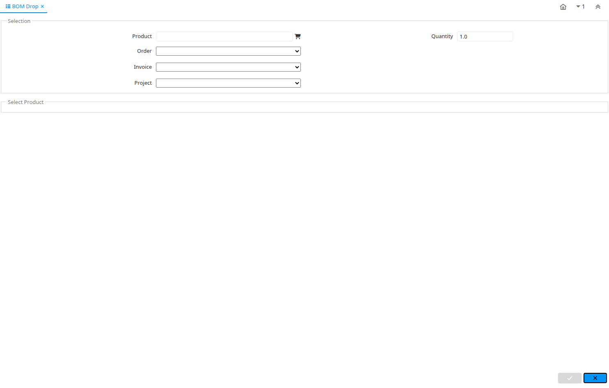

# BOM Drop

Special Form ID 114

*30/12/2003 → 02/01/2000*

**Description:** Drop (expand) Bill of Materials

**Comment/Help:** Drop the extended Bill of Materials into an Order, Invoice, etc.  The documents need to be in a Drafted stage.  Make sure that the items included in the BOM are on the price list of the Order, Invoice, etc. as otherwise the price will be zero!

**Classname:** `org.compiere.apps.form.VBOMDrop`

