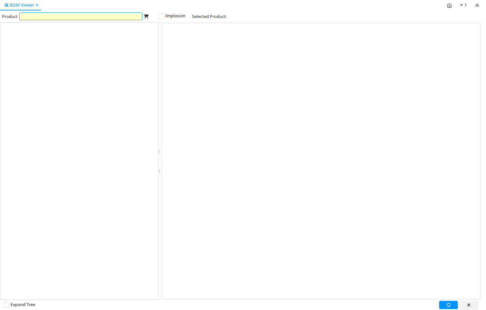

# BOM Viewer

Special Form ID 53017

*27/07/2011 → 27/07/2011*

**Description:** Shows the parent-component relationship for the product entered in the Product field.

**Comment/Help:** Selecting a product will display a hierarchy of components and sub-BOMs for that product.

Selecting the "Where Used" check box will display the BOMs that this product is used in.

**Classname:** `org.compiere.apps.form.VTreeBOM`

