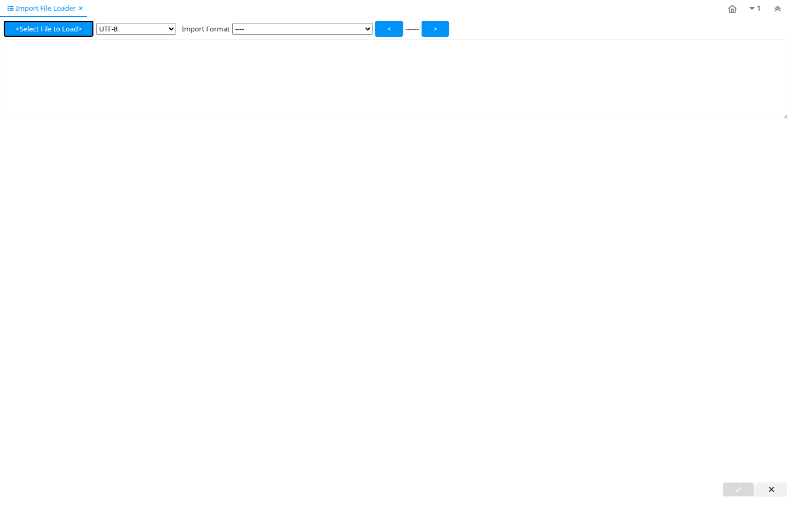

# Import File Loader

Special Form ID 101

*15/09/2000 → 02/01/2000*

**Description:** Load flat Files into import tables

**Comment/Help:** The Import File Loader parses the content of a flat file and loads it into import tables. Comments start with a '[' and end with a ']' and are ignored; example: [Some Heading].

**Classname:** `org.compiere.apps.form.VFileImport`

