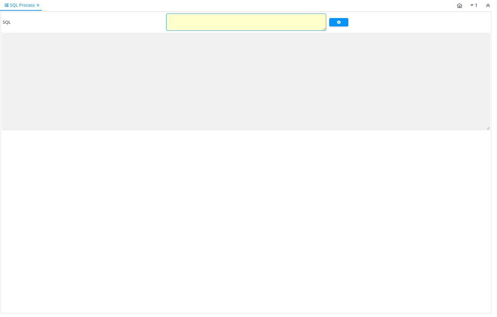

# SQL Process

Special Form ID 111

*18/04/2003 → 02/01/2000*

**Description:** Process SQL Statements

**Comment/Help:** Process SQL DDL Statements

**Classname:** `org.compiere.apps.form.VSQLProcess`

