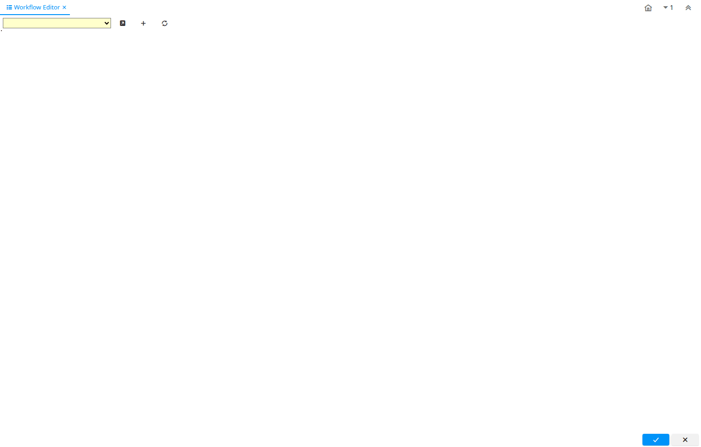

# Workflow Editor

Special Form ID 116

*25/03/2004 → 02/01/2000*

**Description:** Edit Workflows

**Comment/Help:** Edit the graphical layout of workflows

**Classname:** `org.compiere.apps.wf.WFPanel`

