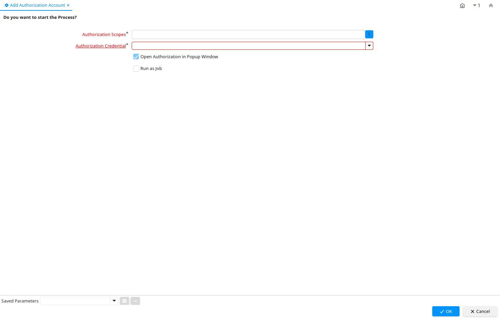

# Add Authorization Account

Process ID 200128

*02/03/2021 → 06/05/2021*

**Classname:** `org.compiere.process.AddAuthorizationProcess`

## Table: Process Parameters

| **Name** | **Description** | **Comment/Help** | **Technical Data** |
|---|---|---|---|
| Authorization Scopes |  |  | AD_AuthorizationScopes Chosen Multiple Selection List |
| Authorization Credential |  |  | AD_AuthorizationCredential_ID Table Direct |
| Open Authorization in Popup Window |  |  | Auth_OpenPopup Yes-No |
| Language | Language for this entity | The Language identifies the language to use for display and formatting | AD_Language Table |
| Callback Answer |  |  | Auth_CallbackAnswer String |

