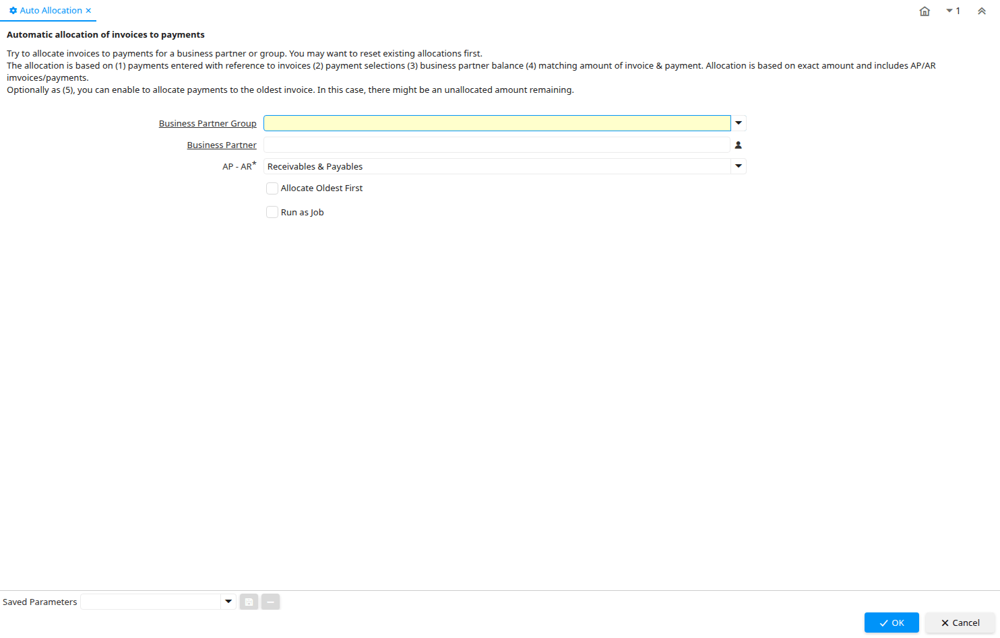

# Auto Allocation

Process ID 302

*15/08/2004 → 02/01/2000*

**Description:** Automatic allocation of invoices to payments

**Comment/Help:** Try to allocate invoices to payments for a business partner or group.  You may want to reset existing allocations first.&lt;br&gt;
The allocation is based on (1) payments entered with reference to invoices (2) payment selections (3) business partner balance (4) matching amount of invoice &amp; payment.  Allocation is based on exact amount and includes AP/AR imvoices/payments.&lt;br&gt;
Optionally as (5), you can enable to allocate payments to the oldest invoice. In this case, there might be an unallocated amount remaining.

**Classname:** `org.compiere.process.AllocationAuto`

## Table: Process Parameters

| **Name** | **Description** | **Comment/Help** | **Technical Data** |
|---|---|---|---|
| Business Partner Group | Business Partner Group | The Business Partner Group provides a method of defining defaults to be used for individual Business Partners. | C_BP_Group_ID Table Direct |
| Business Partner | Identifies a Business Partner | A Business Partner is anyone with whom you transact.  This can include Vendor, Customer, Employee or Salesperson | C_BPartner_ID Search |
| AP - AR | Include Receivables and/or Payables transactions |  | APAR List |
| Allocate Oldest First | Allocate payments to the oldest invoice | Allocate payments to the oldest invoice. There might be an unallocated amount remaining. | AllocateOldest Yes-No |

