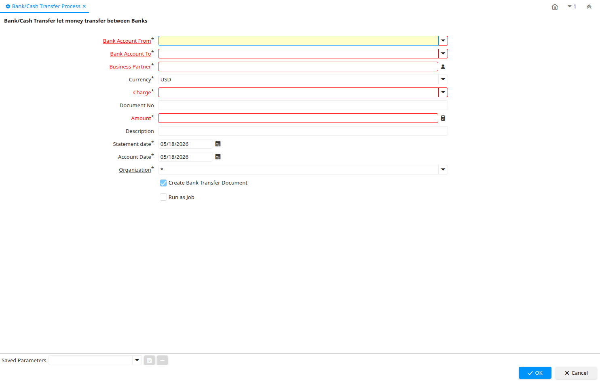

# Bank/Cash Transfer Process

Process ID 53153

*04/09/2008 → 29/04/2022*

**Description:** Bank/Cash Transfer let money transfer between Banks

**Classname:** `org.eevolution.process.BankTransfer`

## Table: Process Parameters

| **Name** | **Description** | **Comment/Help** | **Technical Data** |
|---|---|---|---|
| Bank Account From |  |  | From_C_BankAccount_ID Table |
| Bank Account To |  |  | To_C_BankAccount_ID Table |
| Business Partner | Identifies a Business Partner | A Business Partner is anyone with whom you transact.  This can include Vendor, Customer, Employee or Salesperson | C_BPartner_ID Search |
| Currency | The Currency for this record | Indicates the Currency to be used when processing or reporting on this record | C_Currency_ID Table Direct |
| Currency Type | Currency Conversion Rate Type | The Currency Conversion Rate Type lets you define different type of rates, e.g. Spot, Corporate and/or Sell/Buy rates. | C_ConversionType_ID Table Direct |
| Charge | Additional document charges | The Charge indicates a type of Charge (Handling, Shipping, Restocking) | C_Charge_ID Table Direct |
| Document No | Document sequence number of the document | The document number is usually automatically generated by the system and determined by the document type of the document. If the document is not saved, the preliminary number is displayed in "&lt;&gt;".  If the document type of your document has no automatic document sequence defined, the field is empty if you create a new document. This is for documents which usually have an external number (like vendor invoice).  If you leave the field empty, the system will generate a document number for you. The document sequence used for this fallback number is defined in the "Maintain Sequence" window with the name "DocumentNo_&lt;TableName&gt;", where TableName is the actual name of the table (e.g. C_Order). | DocumentNo String |
| Amount | Amount in a defined currency | The Amount indicates the amount for this document line. | Amount Amount |
| Description | Optional short description of the record | A description is limited to 255 characters. | Description String |
| Statement date | Date of the statement | The Statement Date field defines the date of the statement. | StatementDate Date |
| Account Date | Accounting Date | The Accounting Date indicates the date to be used on the General Ledger account entries generated from this document. It is also used for any currency conversion. | DateAcct Date |
| Organization | Organizational entity within tenant | An organization is a unit of your tenant or legal entity - examples are store, department. You can share data between organizations. | AD_Org_ID Table Direct |
| Create Bank Transfer Document |  |  | IsCreateBankTransferDoc Yes-No |

