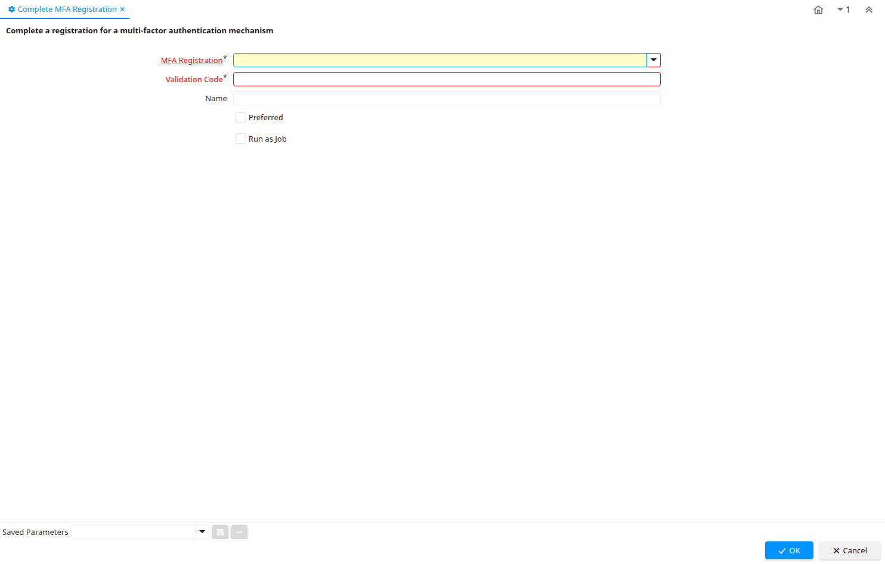

# Complete MFA Registration

Process ID 200130

*30/05/2021 → 04/06/2021*

**Description:** Complete a registration for a multi-factor authentication mechanism

**Classname:** `org.compiere.process.MFACompleteRegistration`

## Table: Process Parameters

| **Name** | **Description** | **Comment/Help** | **Technical Data** |
|---|---|---|---|
| MFA Registration |  |  | MFA_Registration_ID Table |
| Validation Code |  |  | MFAValidationCode String |
| Name | Alphanumeric identifier of the entity | The name of an entity (record) is used as an default search option in addition to the search key. The name is up to 60 characters in length. | Name String |
| Preferred |  |  | IsUserMFAPreferred Yes-No |

