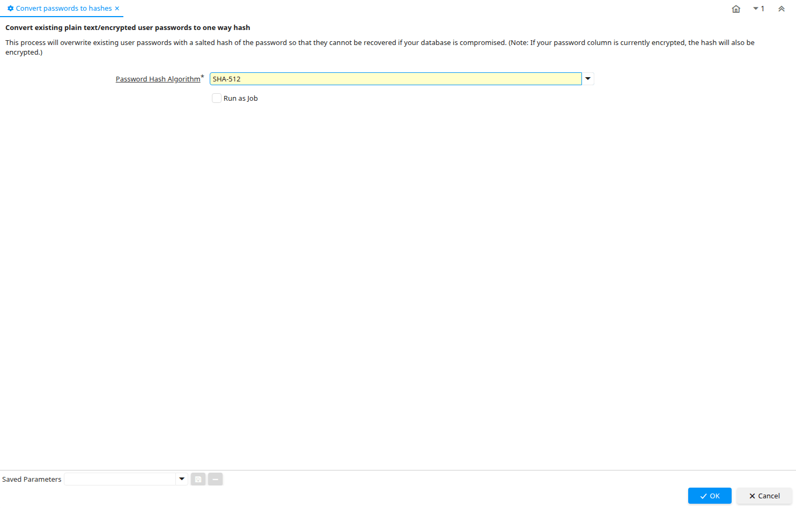

# Convert passwords to hashes

Process ID 53259

*29/06/2011 → 31/10/2025*

**Description:** Convert existing plain text/encrypted user passwords to one way hash

**Comment/Help:** This process will overwrite existing user passwords with a salted hash of the password so that they cannot be recovered if your database is compromised.
(Note: If your password column is currently encrypted, the hash will also be encrypted.)

**Classname:** `org.compiere.process.HashPasswords`

## Table: Process Parameters

| **Name** | **Description** | **Comment/Help** | **Technical Data** |
|---|---|---|---|
| Password Hash Algorithm | Algorithm use to perform hashing of password |  | PasswordHashAlgorithm List |

