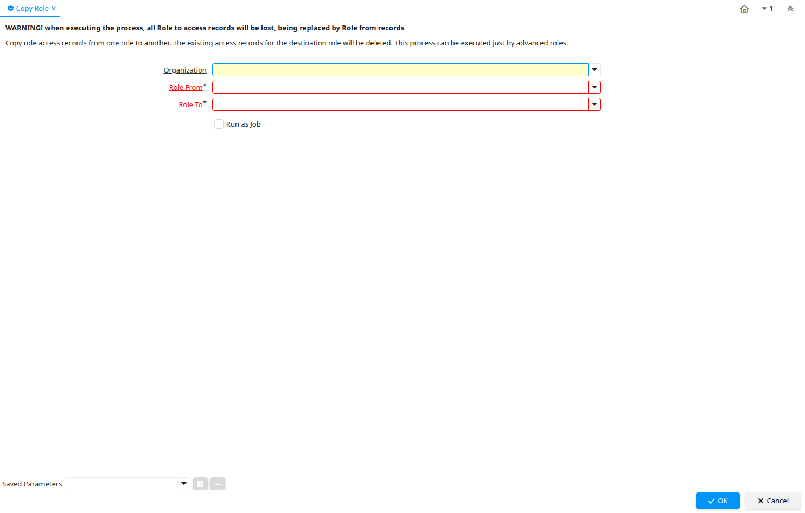

# Copy Role

Process ID 50010

*11/12/2006 → 25/04/2023*

**Description:** WARNING! when executing the process, all Role to access records will be lost, being replaced by Role from records

**Comment/Help:** Copy role access records from one role to another.  The existing access records for the destination role will be deleted.  This process can be executed just by advanced roles.

**Classname:** `org.compiere.process.CopyRole`

## Table: Process Parameters

| **Name** | **Description** | **Comment/Help** | **Technical Data** |
|---|---|---|---|
| Organization | Organizational entity within tenant | An organization is a unit of your tenant or legal entity - examples are store, department. You can share data between organizations. | AD_Org_ID Table Direct |
| Role From | Role that will be copied all accesses | Inform the role that you want to copy the access information | AD_Role_ID_From Table |
| Role To | Role that will receive the copy of access permissions | Inform the role that will receive access information | AD_Role_ID_To Table |

