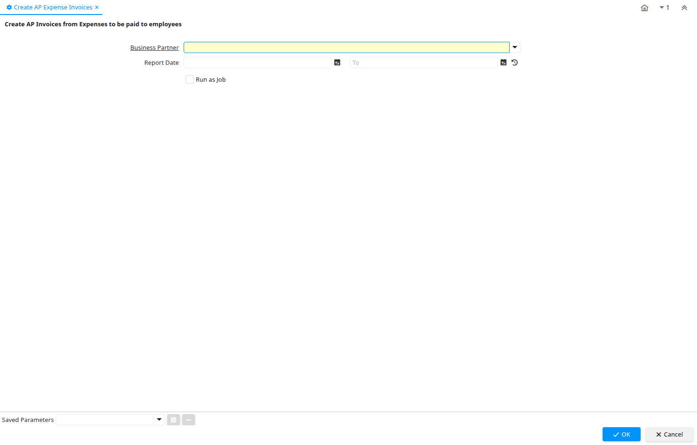

# Create AP Expense Invoices

Process ID 187

*14/07/2002 → 02/01/2000*

**Description:** Create AP Invoices from Expenses to be paid to employees

**Classname:** `org.compiere.process.ExpenseAPInvoice`

## Table: Process Parameters

| **Name** | **Description** | **Comment/Help** | **Technical Data** |
|---|---|---|---|
| Business Partner | Identifies a Business Partner | A Business Partner is anyone with whom you transact.  This can include Vendor, Customer, Employee or Salesperson | C_BPartner_ID Table |
| Report Date | Expense/Time Report Date | Date of Expense/Time Report | DateReport Date |

