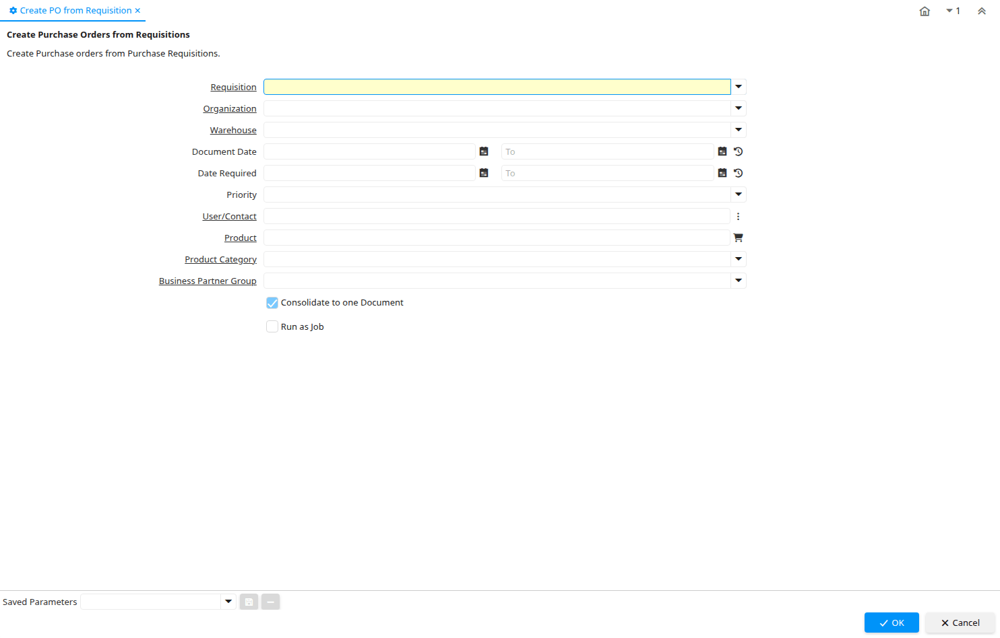

# Create PO from Requisition

Process ID 337

*24/10/2005 → 25/10/2005*

**Description:** Create Purchase Orders from Requisitions

**Comment/Help:** Create Purchase orders from Purchase Requisitions.

**Classname:** `org.compiere.process.RequisitionPOCreate`

## Table: Process Parameters

| **Name** | **Description** | **Comment/Help** | **Technical Data** |
|---|---|---|---|
| Requisition | Material Requisition |  | M_Requisition_ID Table Direct |
| Organization | Organizational entity within tenant | An organization is a unit of your tenant or legal entity - examples are store, department. You can share data between organizations. | AD_Org_ID Table Direct |
| Warehouse | Storage Warehouse and Service Point | The Warehouse identifies a unique Warehouse where products are stored or Services are provided. | M_Warehouse_ID Table Direct |
| Document Date | Date of the Document | The Document Date indicates the date the document was generated.  It may or may not be the same as the accounting date. | DateDoc Date |
| Date Required | Date when required |  | DateRequired Date |
| Priority | Priority of a document | The Priority indicates the importance (high, medium, low) of this document | PriorityRule List |
| User/Contact | User within the system - Internal or Business Partner Contact | The User identifies a unique user in the system. This could be an internal user or a business partner contact | AD_User_ID Search |
| Product | Product, Service, Item | Identifies an item which is either purchased or sold in this organization. | M_Product_ID Search |
| Product Category | Category of a Product | Identifies the category which this product belongs to.  Product categories are used for pricing and selection. | M_Product_Category_ID Table Direct |
| Business Partner Group | Business Partner Group | The Business Partner Group provides a method of defining defaults to be used for individual Business Partners. | C_BP_Group_ID Table Direct |
| Consolidate to one Document | Consolidate Lines into one Document |  | ConsolidateDocument Yes-No |

