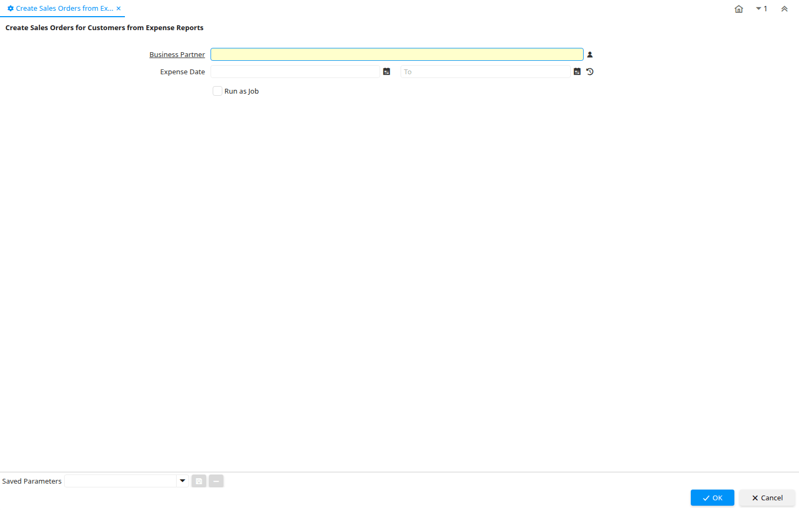

# Create Sales Orders from Expense

Process ID 186

*14/07/2002 → 02/01/2000*

**Description:** Create Sales Orders for Customers from Expense Reports

**Classname:** `org.compiere.process.ExpenseSOrder`

## Table: Process Parameters

| **Name** | **Description** | **Comment/Help** | **Technical Data** |
|---|---|---|---|
| Business Partner | Identifies a Business Partner | A Business Partner is anyone with whom you transact.  This can include Vendor, Customer, Employee or Salesperson | C_BPartner_ID Search |
| Expense Date | Date of expense | Date of expense | DateExpense Date |

