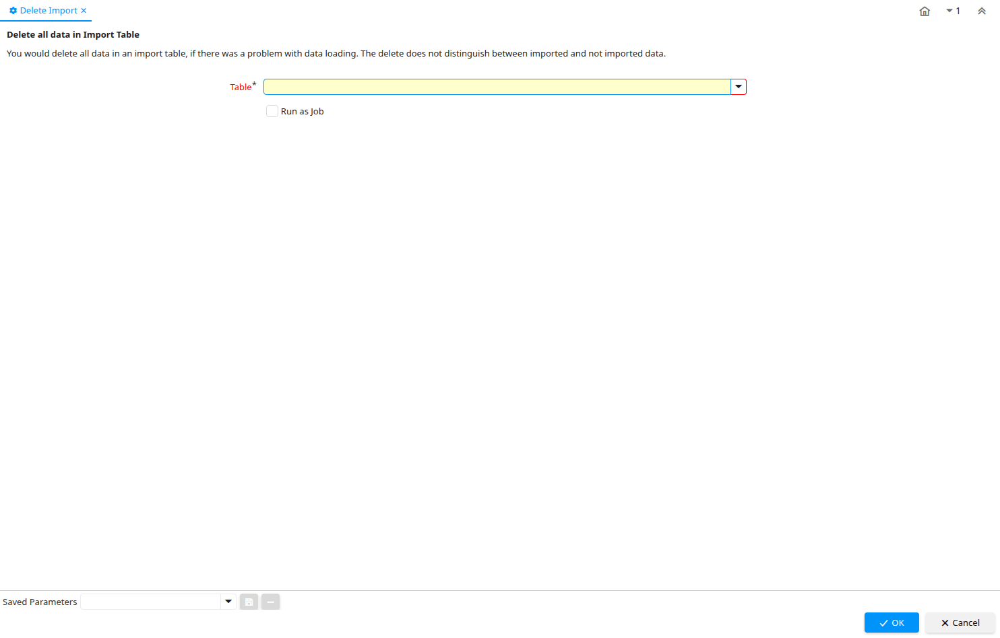

# Delete Import

Process ID 248

*26/12/2003 → 23/10/2005*

**Description:** Delete all data in Import Table

**Comment/Help:** You would delete all data in an import table, if there was a problem with data loading.  The delete does not distinguish between imported and not imported data.

**Classname:** `org.compiere.process.ImportDelete`

## Table: Process Parameters

| **Name** | **Description** | **Comment/Help** | **Technical Data** |
|---|---|---|---|
| Table | Database Table information | The Database Table provides the information of the table definition | AD_Table_ID Table Direct |

