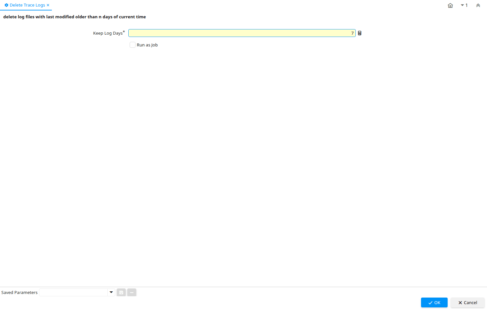

# Delete Trace Logs

Process ID 200156

*05/11/2023 → 05/11/2023*

**Description:** delete log files with last modified older than n days of current time

**Classname:** `org.idempiere.process.DeleteTraceLogs`

## Table: Process Parameters

| **Name** | **Description** | **Comment/Help** | **Technical Data** |
|---|---|---|---|
| Keep Log Days |  |  | KeepLogDays Integer |

