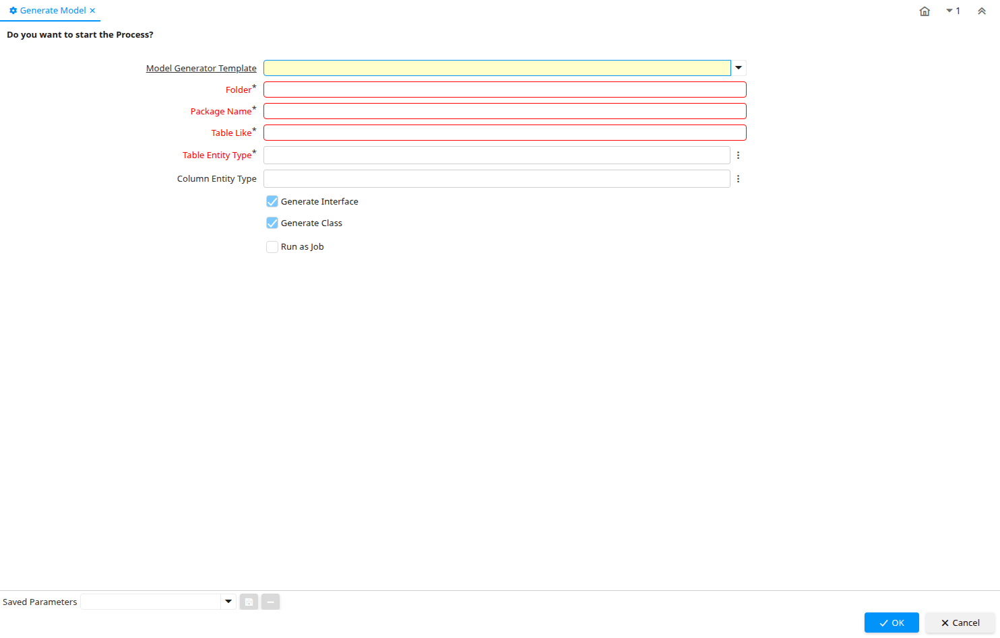

# Generate Model

Process ID 200154

*10/07/2023 → 10/07/2023*

**Classname:** `org.idempiere.process.GenerateModel`

## Table: Process Parameters

| **Name** | **Description** | **Comment/Help** | **Technical Data** |
|---|---|---|---|
| Model Generator Template |  |  | AD_ModelGeneratorTemplate_ID Table Direct |
| Folder | A folder on a local or remote system to store data into | We store files in folders, especially media files. | Folder String |
| Package Name |  |  | PackageName String |
| Table Like | You can use % or a comma separated list of table names enclosed within single quotes (case sensitive) | The DB Table Name indicates the name of the table in database. | TableLike String |
| Table Entity Type |  |  | TableEntityType Chosen Multiple Selection Table |
| Column Entity Type |  |  | ColumnEntityType Chosen Multiple Selection Table |
| Generate Interface |  |  | IsGenerateInterface Yes-No |
| Generate Class |  |  | IsGenerateClass Yes-No |

