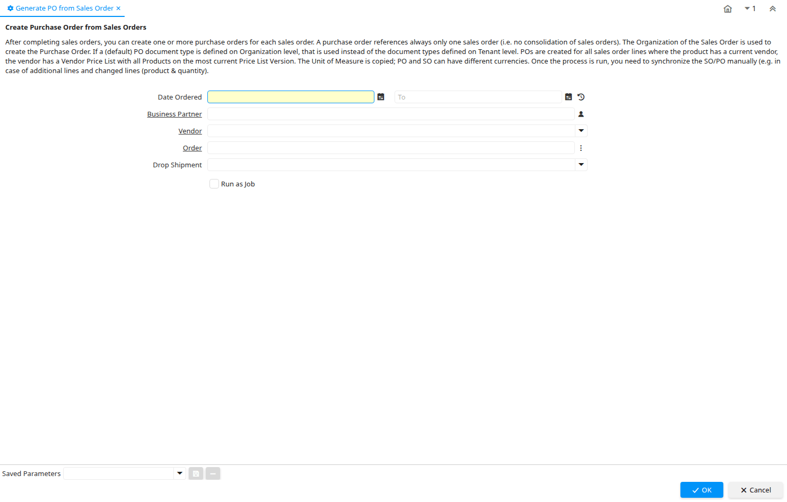

# Generate PO from Sales Order

Process ID 193

*09/12/2002 → 10/03/2022*

**Description:** Create Purchase Order from Sales Orders

**Comment/Help:** After completing sales orders, you can create one or more purchase orders for each sales order. A purchase order references always only one sales order (i.e. no consolidation of sales orders). 
The Organization of the Sales Order is used to create the Purchase Order. If a (default) PO document type is defined on Organization level, that is used instead of the document types defined on Tenant level.

POs are created for all sales order lines where the product has a current vendor, the vendor has a Vendor Price List with all Products on the most current Price List Version. The Unit of Measure is copied; PO and SO can have different currencies.

Once the process is run, you need to synchronize the SO/PO manually (e.g. in case of additional lines and changed lines (product &amp; quantity).

**Classname:** `org.compiere.process.OrderPOCreate`

## Table: Process Parameters

| **Name** | **Description** | **Comment/Help** | **Technical Data** |
|---|---|---|---|
| Date Ordered | Date of Order | Indicates the Date an item was ordered. | DateOrdered Date |
| Business Partner | Identifies a Business Partner | A Business Partner is anyone with whom you transact.  This can include Vendor, Customer, Employee or Salesperson | C_BPartner_ID Search |
| Vendor | The Vendor of the product/service |  | Vendor_ID Table |
| Order | Order | The Order is a control document.  The  Order is complete when the quantity ordered is the same as the quantity shipped and invoiced.  When you close an order, unshipped (backordered) quantities are cancelled. | C_Order_ID Search |
| Drop Shipment | Drop Shipments are sent directly to the Drop Shipment Location | Drop Shipments are sent directly to the Drop Shipment Location using the Drop Ship Business Partner name and contact. | IsDropShip List |

