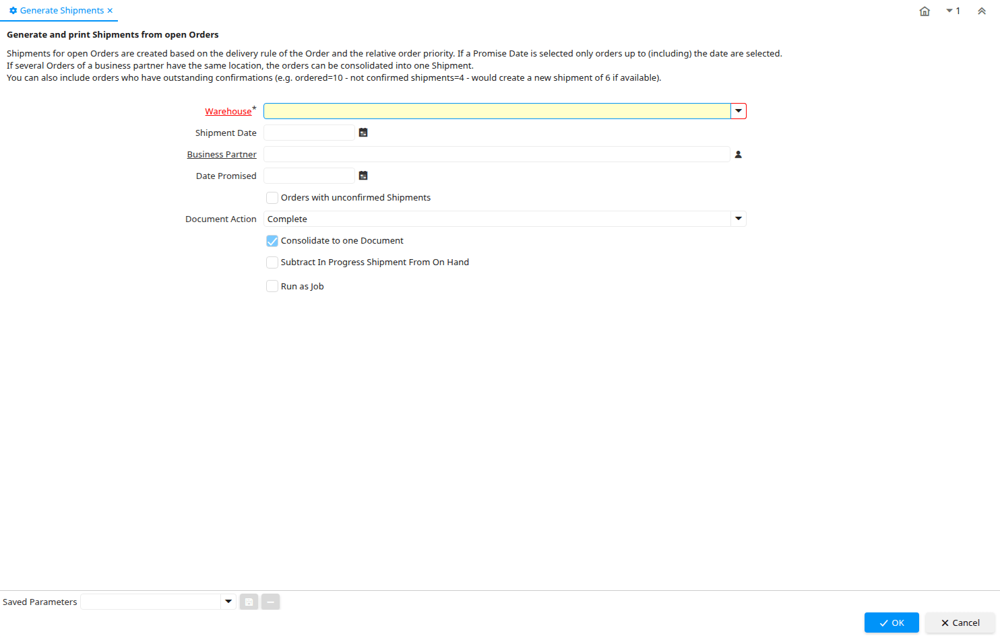

# Generate Shipments

Process ID 118

*26/04/2000 → 05/01/2005*

**Description:** Generate and print Shipments from open Orders

**Comment/Help:** Shipments for open Orders are created based on the delivery rule of the Order and the relative order priority.  If a Promise Date is selected only orders up to (including) the date are selected.&lt;br&gt;
If several Orders of a business partner have the same location, the orders can be consolidated into one Shipment.&lt;br&gt;
You can also include orders who have outstanding confirmations (e.g. ordered=10 - not confirmed shipments=4 - would create a new shipment of 6 if available).

**Classname:** `org.compiere.process.InOutGenerate`

## Table: Process Parameters

| **Name** | **Description** | **Comment/Help** | **Technical Data** |
|---|---|---|---|
| Warehouse | Storage Warehouse and Service Point | The Warehouse identifies a unique Warehouse where products are stored or Services are provided. | M_Warehouse_ID Table Direct |
| Shipment Date | Date printed on shipment | The Shipment Date indicates the date printed on the shipment. | MovementDate Date |
| Business Partner | Identifies a Business Partner | A Business Partner is anyone with whom you transact.  This can include Vendor, Customer, Employee or Salesperson | C_BPartner_ID Search |
| Date Promised | Date Order was promised | The Date Promised indicates the date, if any, that an Order was promised for. | DatePromised Date |
| Orders with unconfirmed Shipments | Generate shipments for Orders with open delivery confirmations? | You can also include orders who have outstanding confirmations (e.g. ordered=10 - not confirmed shipments=4 - would create a new shipment of 6 if available). | IsUnconfirmedInOut Yes-No |
| Document Action | The targeted status of the document | You find the current status in the Document Status field. The options are listed in a popup | DocAction List |
| Consolidate to one Document | Consolidate Lines into one Document |  | ConsolidateDocument Yes-No |
| Subtract In Progress Shipment From On Hand | Subtract In Progress Shipment From On Hand |  | SubtractOnHand Yes-No |

