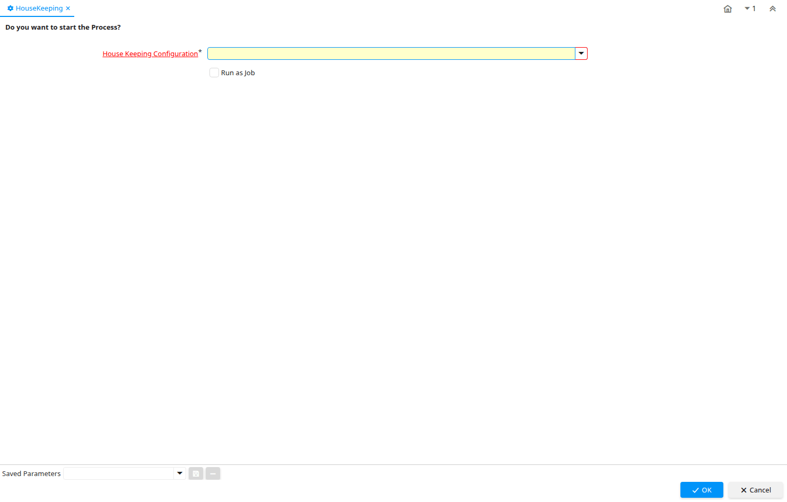

# HouseKeeping

Process ID 53154

*06/09/2008 → 06/09/2008*

**Classname:** `org.adempiere.process.HouseKeeping`

## Table: Process Parameters

| **Name** | **Description** | **Comment/Help** | **Technical Data** |
|---|---|---|---|
| House Keeping Configuration |  |  | AD_HouseKeeping_ID Table Direct |

