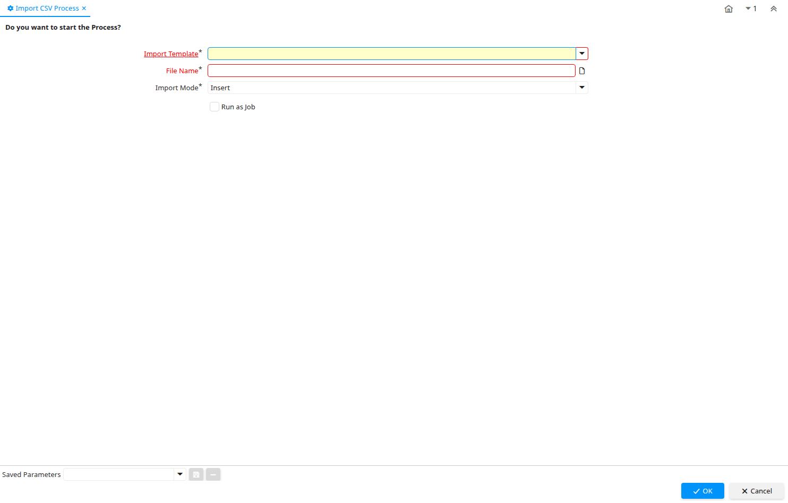

# Import CSV Process

Process ID 200076

*02/12/2014 → 02/12/2014*

**Classname:** `org.idempiere.process.ImportCSVProcess`

## Table: Process Parameters

| **Name** | **Description** | **Comment/Help** | **Technical Data** |
|---|---|---|---|
| Import Template |  |  | AD_ImportTemplate_ID Table Direct |
| File Name | Name of the local file or URL | Name of a file in the local directory space - or URL (file://.., http://.., ftp://..) | FileName FileName |
| Import Mode |  |  | ImportMode List |

