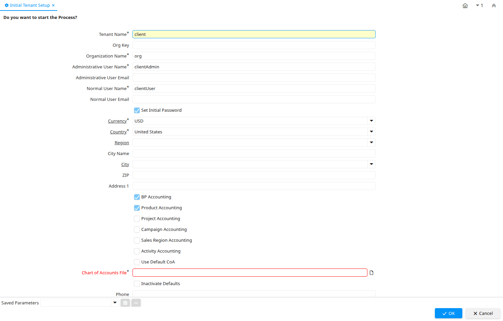

# Initial Tenant Setup

Process ID 53161

*14/02/2009 → 10/03/2022*

**Classname:** `org.adempiere.process.InitialClientSetup`

## Table: Process Parameters

| **Name** | **Description** | **Comment/Help** | **Technical Data** |
|---|---|---|---|
| Tenant Name |  |  | ClientName String |
| Org Key | Key of the Organization |  | OrgValue String |
| Organization Name | Name of the Organization |  | OrgName String |
| Administrative User Name |  |  | AdminUserName String |
| Administrative User Email |  |  | AdminUserEmail String |
| Normal User Name |  |  | NormalUserName String |
| Normal User Email |  |  | NormalUserEmail String |
| Set Initial Password |  |  | IsSetInitialPassword Yes-No |
| Currency | The Currency for this record | Indicates the Currency to be used when processing or reporting on this record | C_Currency_ID Table Direct |
| Country | Country  | The Country defines a Country.  Each Country must be defined before it can be used in any document. | C_Country_ID Table Direct |
| Region | Identifies a geographical Region | The Region identifies a unique Region for this Country. | C_Region_ID Table Direct |
| City Name |  |  | CityName String |
| City | City | City in a country | C_City_ID Table Direct |
| ZIP | Postal code | The Postal Code or ZIP identifies the postal code for this entity's address. | Postal String |
| Address 1 | Address line 1 for this location | The Address 1 identifies the address for an entity's location | Address1 String |
| BP Accounting | Use BP accounting dimension | Define if this tenant will use business partner accounting dimension.  This can be changed later in Accounting Schema window of the tenant. | IsUseBPDimension Yes-No |
| Product Accounting | Use Product accounting dimension | Define if this tenant will use product accounting dimension.  This can be changed later in Accounting Schema window of the tenant. | IsUseProductDimension Yes-No |
| Project Accounting | Use Project accounting dimension | Define if this tenant will use project accounting dimension.  This can be changed later in Accounting Schema window of the tenant. | IsUseProjectDimension Yes-No |
| Campaign Accounting | Use Campaign accounting dimension | Define if this tenant will use campaign accounting dimension.  This can be changed later in Accounting Schema window of the tenant. | IsUseCampaignDimension Yes-No |
| Sales Region Accounting | Use Sales Region accounting dimension | Define if this tenant will use sales region accounting dimension.  This can be changed later in Accounting Schema window of the tenant. | IsUseSalesRegionDimension Yes-No |
| Activity Accounting | Use Activity accounting dimension | Define if this tenant will use activity accounting dimension.  This can be changed later in Accounting Schema window of the tenant. | IsUseActivityDimension Yes-No |
| Use Default CoA | Use Default Chart of Accounts |  | UseDefaultCoA Yes-No |
| Chart of Accounts File | Location of the chart of accounts to be used with this tenant.  At this stage just the default accounts will be created. |  | CoAFile FileName |
| Inactivate Defaults | Inactivate Defaults after Created |  | InactivateDefaults Yes-No |
| Phone | Identifies a telephone number | The Phone field identifies a telephone number | Phone String |
| 2nd Phone | Identifies an alternate telephone number. | The 2nd Phone field identifies an alternate telephone number. | Phone2 String |
| Fax | Facsimile number | The Fax identifies a facsimile number for this Business Partner or  Location | Fax String |
| EMail Address | Electronic Mail Address | The Email Address is the Electronic Mail ID for this User and should be fully qualified (e.g. joe.smith@company.com). The Email Address is used to access the self service application functionality from the web. | EMail String |
| Tax ID | Tax Identification | The Tax ID field identifies the legal Identification number of this Entity. | TaxID String |

