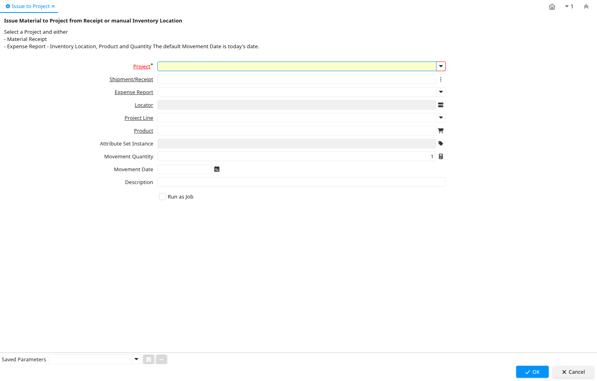

# Issue to Project

Process ID 224

*02/09/2003 → 02/01/2000*

**Description:** Issue Material to Project from Receipt or manual Inventory Location

**Comment/Help:** Select a Project and either
&lt;br&gt;- Material Receipt
&lt;br&gt;- Expense Report
&lt;br&lt;- Inventory Location and Project Line not issued yet
&lt;br&gt;- Inventory Location, Product and Quantity
The default Movement Date is today's date.

**Classname:** `org.compiere.process.ProjectIssue`

## Table: Process Parameters

| **Name** | **Description** | **Comment/Help** | **Technical Data** |
|---|---|---|---|
| Project | Financial Project | A Project allows you to track and control internal or external activities. | C_Project_ID Table Direct |
| Shipment/Receipt | Material Shipment Document | The Material Shipment / Receipt  | M_InOut_ID Search |
| Expense Report | Time and Expense Report |  | S_TimeExpense_ID Table Direct |
| Locator | Warehouse Locator | The Locator indicates where in a Warehouse a product is located. | M_Locator_ID Locator (WH) |
| Project Line | Task or step in a project | The Project Line indicates a unique project line. | C_ProjectLine_ID Table Direct |
| Product | Product, Service, Item | Identifies an item which is either purchased or sold in this organization. | M_Product_ID Search |
| Attribute Set Instance | Product Attribute Set Instance | The values of the actual Product Attribute Instances.  The product level attributes are defined on Product level. | M_AttributeSetInstance_ID Product Attribute |
| Movement Quantity | Quantity of a product moved. | The Movement Quantity indicates the quantity of a product that has been moved. | MovementQty Quantity |
| Movement Date | Date a product was moved in or out of inventory | The Movement Date indicates the date that a product moved in or out of inventory.  This is the result of a shipment, receipt or inventory movement. | MovementDate Date |
| Description | Optional short description of the record | A description is limited to 255 characters. | Description String |

