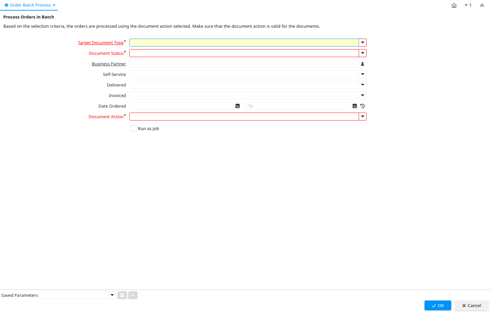

# Order Batch Process

Process ID 315

*07/01/2005 → 07/01/2005*

**Description:** Process Orders in Batch

**Comment/Help:** Based on the selection criteria, the orders are processed using the document action selected.  Make sure that the document action is valid for the documents.

**Classname:** `org.compiere.process.OrderBatchProcess`

## Table: Process Parameters

| **Name** | **Description** | **Comment/Help** | **Technical Data** |
|---|---|---|---|
| Target Document Type | Target document type for conversing documents | You can convert document types (e.g. from Offer to Order or Invoice).  The conversion is then reflected in the current type.  This processing is initiated by selecting the appropriate Document Action. | C_DocTypeTarget_ID Table |
| Document Status | The current status of the document | The Document Status indicates the status of a document at this time.  If you want to change the document status, use the Document Action field | DocStatus List |
| Business Partner | Identifies a Business Partner | A Business Partner is anyone with whom you transact.  This can include Vendor, Customer, Employee or Salesperson | C_BPartner_ID Search |
| Self-Service | This is a Self-Service entry or this entry can be changed via Self-Service | Self-Service allows users to enter data or update their data.  The flag indicates, that this record was entered or created via Self-Service or that the user can change it via the Self-Service functionality. | IsSelfService List |
| Delivered |  |  | IsDelivered List |
| Invoiced | Is this invoiced? | If selected, invoices are created | IsInvoiced List |
| Date Ordered | Date of Order | Indicates the Date an item was ordered. | DateOrdered Date |
| Document Action | The targeted status of the document | You find the current status in the Document Status field. The options are listed in a popup | DocAction List |

