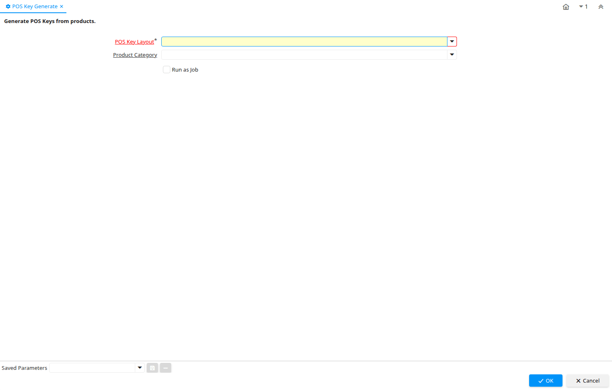

# POS Key Generate

Process ID 53202

*24/03/2010 → 24/03/2010*

**Description:** Generate POS Keys from products.

**Classname:** `org.compiere.process.PosKeyGenerate`

## Table: Process Parameters

| **Name** | **Description** | **Comment/Help** | **Technical Data** |
|---|---|---|---|
| POS Key Layout | POS Function Key Layout | POS Function Key Layout | C_POSKeyLayout_ID Table Direct |
| Product Category | Category of a Product | Identifies the category which this product belongs to.  Product categories are used for pricing and selection. | M_Product_Category_ID Table Direct |

