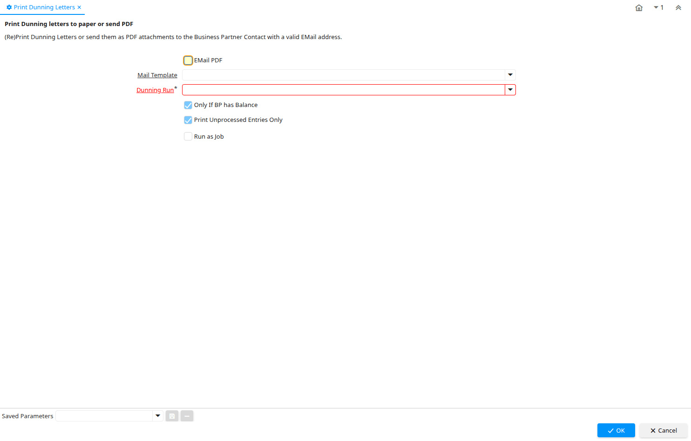

# Print Dunning Letters

Process ID 312

*30/11/2004 → 15/01/2024*

**Description:** Print Dunning letters to paper or send PDF

**Comment/Help:** (Re)Print Dunning Letters or send them as PDF attachments to the Business Partner Contact with a valid EMail address.

**Classname:** `org.compiere.process.DunningPrint`

## Table: Process Parameters

| **Name** | **Description** | **Comment/Help** | **Technical Data** |
|---|---|---|---|
| EMail PDF | Email Document PDF files to Business Partner |  | EMailPDF Yes-No |
| Mail Template | Text templates for mailings | The Mail Template indicates the mail template for return messages. Mail text can include variables.  The priority of parsing is User/Contact, Business Partner and then the underlying business object (like Request, Dunning, Workflow object).&lt;br&gt; So, @Name@ would resolve into the User name (if user is defined defined), then Business Partner name (if business partner is defined) and then the Name of the business object if it has a Name.&lt;br&gt; For Multi-Lingual systems, the template is translated based on the Business Partner's language selection. | R_MailText_ID Table Direct |
| Dunning Run | Dunning Run |  | C_DunningRun_ID Table Direct |
| Only If BP has Balance | Include only if Business Partner has outstanding Balance |  | IsOnlyIfBPBalance Yes-No |
| Print Unprocessed Entries Only | Print the unprocessed (unprinted) entries of the dunning run only. | Print the unprocessed (unprinted) entries of the dunning run only. This allows you to reprint only certain dunning entries. | PrintUnprocessedOnly Yes-No |

