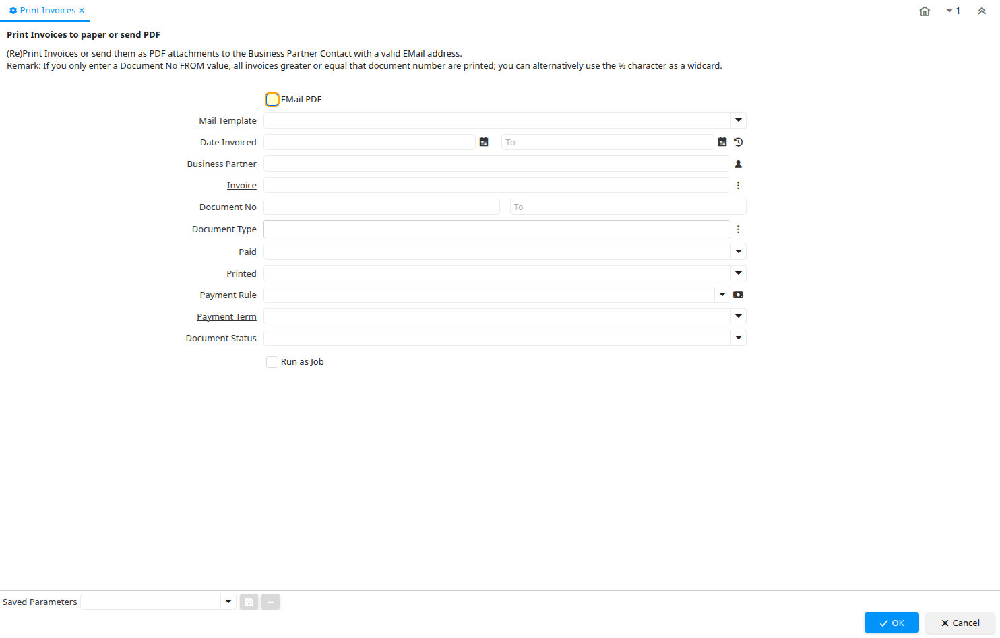

# Print Invoices

Process ID 200

*29/01/2003 → 15/01/2024*

**Description:** Print Invoices to paper or send PDF

**Comment/Help:** (Re)Print Invoices or send them as PDF attachments to the Business Partner Contact with a valid EMail address.
&lt;br&gt;
Remark: If you only enter a Document No FROM value, all invoices greater or equal that document number are printed; you can alternatively use the % character as a widcard.

**Classname:** `org.compiere.process.InvoicePrint`

## Table: Process Parameters

| **Name** | **Description** | **Comment/Help** | **Technical Data** |
|---|---|---|---|
| EMail PDF | Email Document PDF files to Business Partner |  | EMailPDF Yes-No |
| Mail Template | Text templates for mailings | The Mail Template indicates the mail template for return messages. Mail text can include variables.  The priority of parsing is User/Contact, Business Partner and then the underlying business object (like Request, Dunning, Workflow object).&lt;br&gt; So, @Name@ would resolve into the User name (if user is defined defined), then Business Partner name (if business partner is defined) and then the Name of the business object if it has a Name.&lt;br&gt; For Multi-Lingual systems, the template is translated based on the Business Partner's language selection. | R_MailText_ID Table Direct |
| Date Invoiced | Date printed on Invoice | The Date Invoice indicates the date printed on the invoice. | DateInvoiced Date |
| Business Partner | Identifies a Business Partner | A Business Partner is anyone with whom you transact.  This can include Vendor, Customer, Employee or Salesperson | C_BPartner_ID Search |
| Invoice | Invoice Identifier | The Invoice Document. | C_Invoice_ID Search |
| Document No | Document sequence number of the document | The document number is usually automatically generated by the system and determined by the document type of the document. If the document is not saved, the preliminary number is displayed in "&lt;&gt;".  If the document type of your document has no automatic document sequence defined, the field is empty if you create a new document. This is for documents which usually have an external number (like vendor invoice).  If you leave the field empty, the system will generate a document number for you. The document sequence used for this fallback number is defined in the "Maintain Sequence" window with the name "DocumentNo_&lt;TableName&gt;", where TableName is the actual name of the table (e.g. C_Order). | DocumentNo String |
| Document Type | Document type or rules | The Document Type determines document sequence and processing rules | C_DocType_ID Chosen Multiple Selection Table |
| Paid | The document is fully paid |  | IsPaid List |
| Printed | Indicates if this document / line is printed | The Printed checkbox indicates if this document or line will included when printing. | IsPrinted List |
| Payment Rule | How you pay the invoice | The Payment Rule indicates the method of invoice payment. | PaymentRule Payment |
| Payment Term | The terms of Payment (timing, discount) | Payment Terms identify the method and timing of payment. | C_PaymentTerm_ID Table Direct |
| Document Status | The current status of the document | The Document Status indicates the status of a document at this time.  If you want to change the document status, use the Document Action field | DocStatus List |

