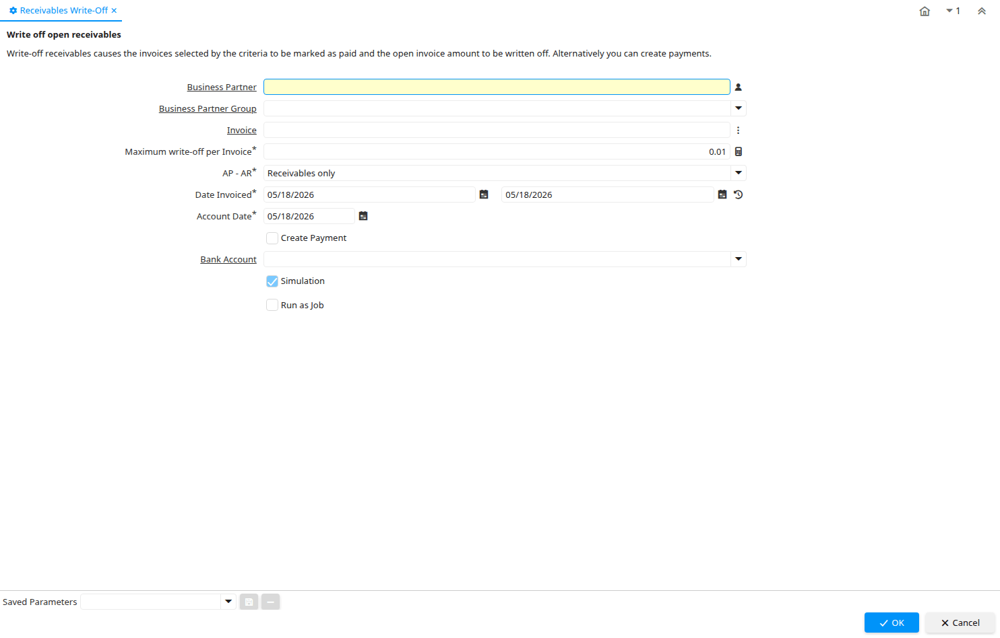

# Receivables Write-Off

Process ID 171

*14/11/2001 → 27/11/2005*

**Description:** Write off open receivables

**Comment/Help:** Write-off receivables causes the invoices selected by the criteria to be marked as paid and the open invoice amount to be written off.  Alternatively you can create payments.

**Classname:** `org.compiere.process.InvoiceWriteOff`

## Table: Process Parameters

| **Name** | **Description** | **Comment/Help** | **Technical Data** |
|---|---|---|---|
| Business Partner | Identifies a Business Partner | A Business Partner is anyone with whom you transact.  This can include Vendor, Customer, Employee or Salesperson | C_BPartner_ID Search |
| Business Partner Group | Business Partner Group | The Business Partner Group provides a method of defining defaults to be used for individual Business Partners. | C_BP_Group_ID Table Direct |
| Invoice | Invoice Identifier | The Invoice Document. | C_Invoice_ID Search |
| Maximum write-off per Invoice | Maximum invoice amount to be written off in invoice currency |  | MaxInvWriteOffAmt Amount |
| AP - AR | Include Receivables and/or Payables transactions |  | APAR List |
| Date Invoiced | Date printed on Invoice | The Date Invoice indicates the date printed on the invoice. | DateInvoiced Date |
| Account Date | Accounting Date | The Accounting Date indicates the date to be used on the General Ledger account entries generated from this document. It is also used for any currency conversion. | DateAcct Date |
| Create Payment |  |  | CreatePayment Yes-No |
| Bank Account | Account at the Bank | The Bank Account identifies an account at this Bank. | C_BankAccount_ID Table Direct |
| Simulation | Performing the function is only simulated |  | IsSimulation Yes-No |

