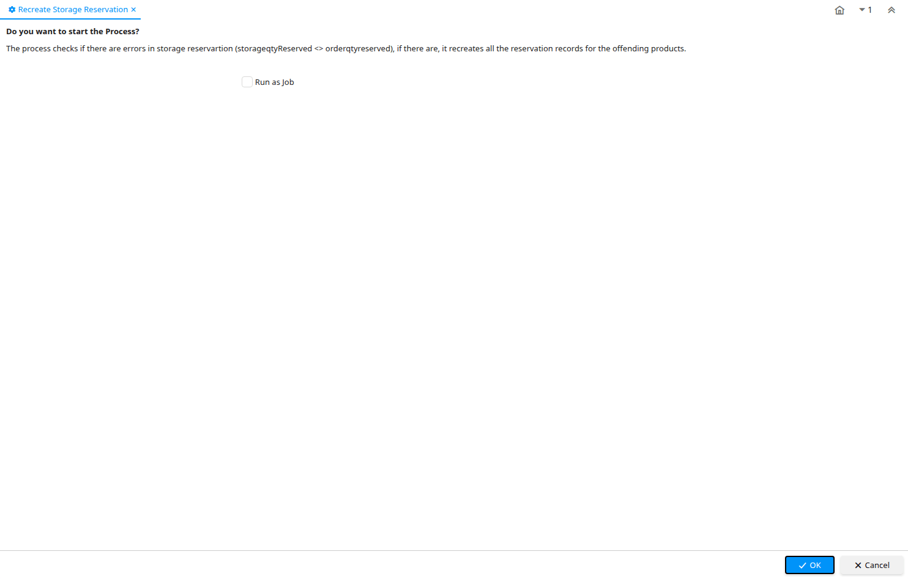

# Recreate Storage Reservation

Process ID 200107

*11/02/2019 → 11/02/2019*

**Comment/Help:** The process checks if there are errors in storage reservartion (storageqtyReserved &lt;&gt; orderqtyreserved), if there are, it recreates all the reservation records for the offending products.

**Classname:** `org.adempiere.process.RecreateStorageReservation`

