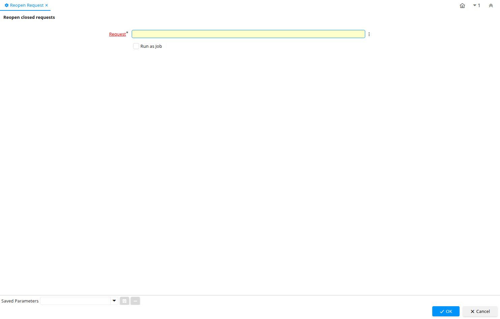

# Reopen Request

Process ID 195

*10/01/2003 → 02/01/2000*

**Description:** Reopen closed requests

**Classname:** `org.compiere.process.RequestReOpen`

## Table: Process Parameters

| **Name** | **Description** | **Comment/Help** | **Technical Data** |
|---|---|---|---|
| Request | Request from a Business Partner or Prospect | The Request identifies a unique request from a Business Partner or Prospect. | R_Request_ID Search |

