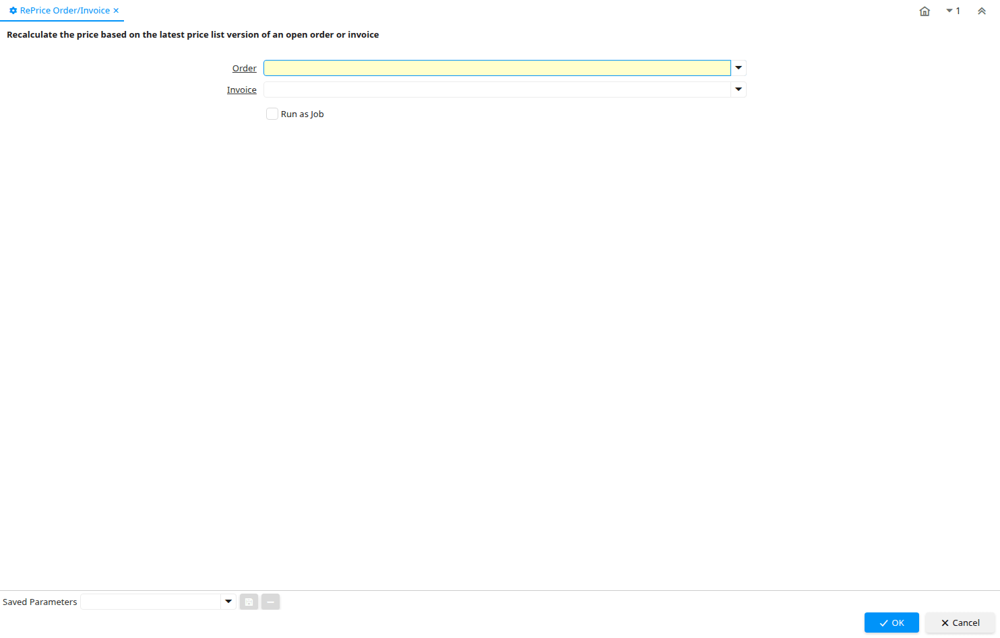

# RePrice Order/Invoice

Process ID 232

*04/10/2003 → 02/01/2000*

**Description:** Recalculate the price based on the latest price list version of an open order or invoice

**Classname:** `org.compiere.process.OrderRePrice`

## Table: Process Parameters

| **Name** | **Description** | **Comment/Help** | **Technical Data** |
|---|---|---|---|
| Order | Order | The Order is a control document.  The  Order is complete when the quantity ordered is the same as the quantity shipped and invoiced.  When you close an order, unshipped (backordered) quantities are cancelled. | C_Order_ID Table Direct |
| Invoice | Invoice Identifier | The Invoice Document. | C_Invoice_ID Table Direct |

