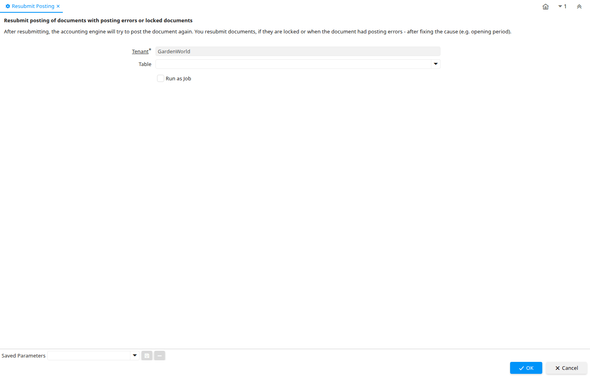

# Resubmit Posting

Process ID 175

*02/12/2001 → 23/03/2026*

**Description:** Resubmit posting of documents with posting errors or locked documents

**Comment/Help:** After resubmitting, the accounting engine will try to post the document again. You resubmit documents, if they are locked or when the document had posting errors - after fixing the cause (e.g. opening period).

**Classname:** `org.idempiere.acct.process.FactAcctReset`

## Table: Process Parameters

| **Name** | **Description** | **Comment/Help** | **Technical Data** |
|---|---|---|---|
| Tenant | Tenant for this installation. | A Tenant is a company or a legal entity. You cannot share data between Tenants. | AD_Client_ID Table Direct |
| Table | Database Table information | The Database Table provides the information of the table definition | AD_Table_ID Table |

