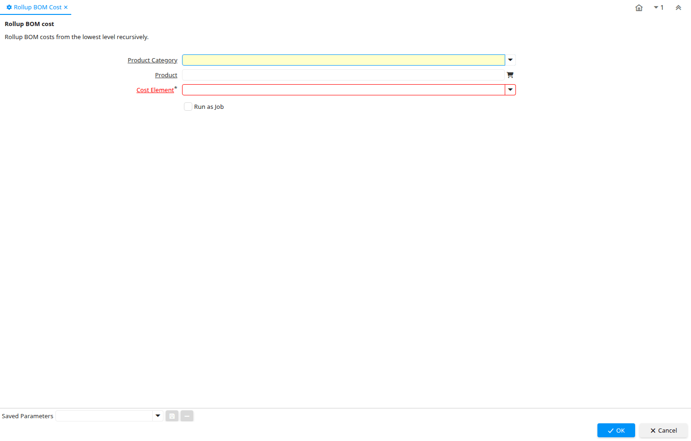

# Rollup BOM Cost

Process ID 53230

*27/07/2011 → 27/07/2011*

**Description:** Rollup BOM cost

**Comment/Help:** Rollup BOM costs from the lowest level recursively.

**Classname:** `org.compiere.process.RollUpCosts`

## Table: Process Parameters

| **Name** | **Description** | **Comment/Help** | **Technical Data** |
|---|---|---|---|
| Product Category | Category of a Product | Identifies the category which this product belongs to.  Product categories are used for pricing and selection. | M_Product_Category_ID Table Direct |
| Product | Product, Service, Item | Identifies an item which is either purchased or sold in this organization. | M_Product_ID Search |
| Cost Element | Product Cost Element |  | M_CostElement_ID Table Direct |

