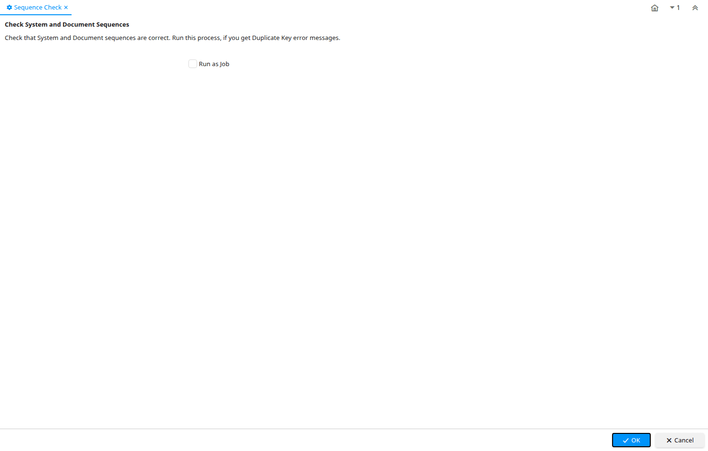

# Sequence Check

Process ID 258

*05/03/2004 → 26/03/2008*

**Description:** Check System and Document Sequences

**Comment/Help:** Check that System and Document sequences are correct.  Run this process, if you get Duplicate Key error messages.

**Classname:** `org.compiere.process.SequenceCheck`

