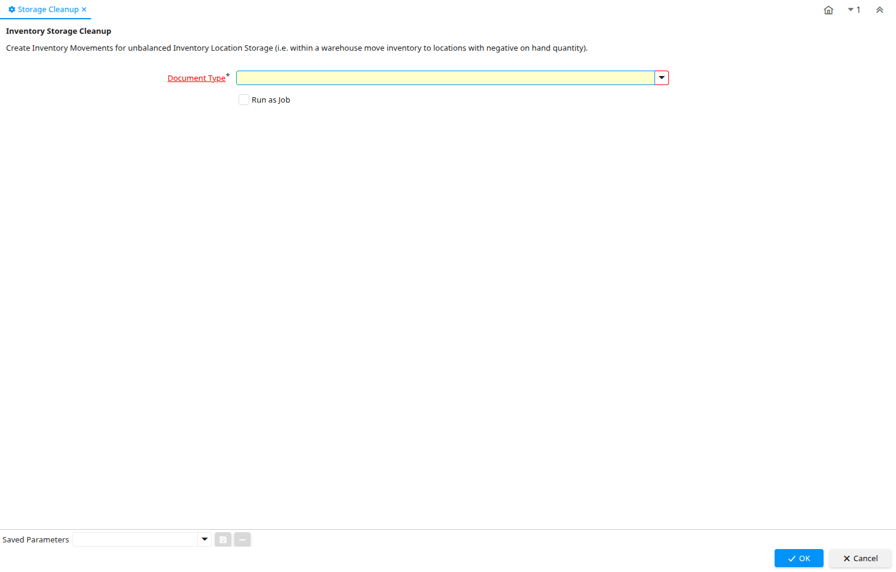

# Storage Cleanup

Process ID 325

*29/05/2005 → 29/05/2005*

**Description:** Inventory Storage Cleanup

**Comment/Help:** Create Inventory Movements for unbalanced Inventory Location Storage (i.e. within a warehouse move inventory to locations with negative on hand quantity).

**Classname:** `org.compiere.process.StorageCleanup`

## Table: Process Parameters

| **Name** | **Description** | **Comment/Help** | **Technical Data** |
|---|---|---|---|
| Document Type | Document type or rules | The Document Type determines document sequence and processing rules | C_DocType_ID Table Direct |

