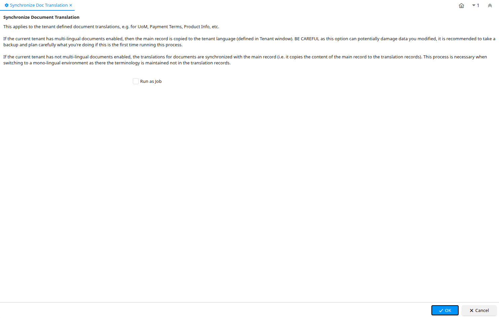

# Synchronize Doc Translation

Process ID 321

*10/03/2005 → 15/01/2024*

**Description:** Synchronize Document Translation

**Comment/Help:** This applies to the tenant defined document translations, e.g. for UoM, Payment Terms, Product Info, etc.&lt;br&gt;
&lt;br&gt;
If the current tenant has multi-lingual documents enabled, then the main record is copied to the tenant language (defined in Tenant window).  BE CAREFUL as this option can potentially damage data you modified, it is recommended to take a backup and plan carefully what you're doing if this is the first time running this process.&lt;br&gt;
&lt;br&gt;
If the current tenant has not multi-lingual documents enabled, the translations for documents are synchronized with the main record (i.e. it copies the content of the main record to the translation records).  This process is necessary when switching to a mono-lingual environment as there the terminology is maintained not in the translation records.

**Classname:** `org.compiere.process.TranslationDocSync`

