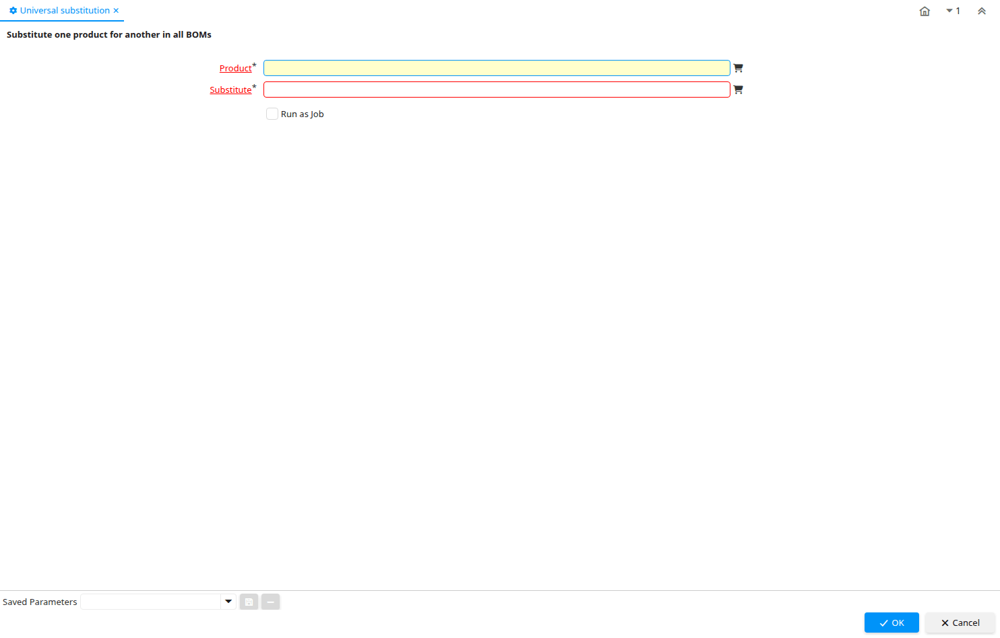

# Universal substitution

Process ID 53265

*27/07/2011 → 27/07/2011*

**Description:** Substitute one product for another in all BOMs

**Classname:** `org.compiere.process.UniversalSubstitution`

## Table: Process Parameters

| **Name** | **Description** | **Comment/Help** | **Technical Data** |
|---|---|---|---|
| Product | Product, Service, Item | Identifies an item which is either purchased or sold in this organization. | M_Product_ID Search |
| Substitute | Entity which can be used in place of this entity | The Substitute identifies the entity to be used as a substitute for this entity. | Substitute_ID Search |

