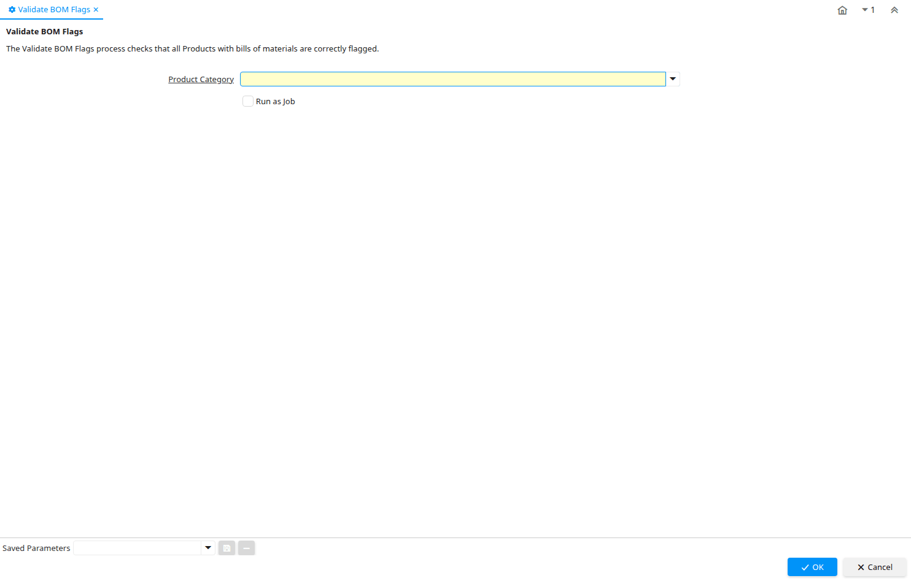

# Validate BOM Flags

Process ID 53228

*27/07/2011 → 27/07/2011*

**Description:** Validate BOM Flags

**Comment/Help:** The Validate BOM Flags process checks that all Products with bills of materials are correctly flagged.

**Classname:** `org.compiere.process.BOMFlagValidate`

## Table: Process Parameters

| **Name** | **Description** | **Comment/Help** | **Technical Data** |
|---|---|---|---|
| Product Category | Category of a Product | Identifies the category which this product belongs to.  Product categories are used for pricing and selection. | M_Product_Category_ID Table Direct |

