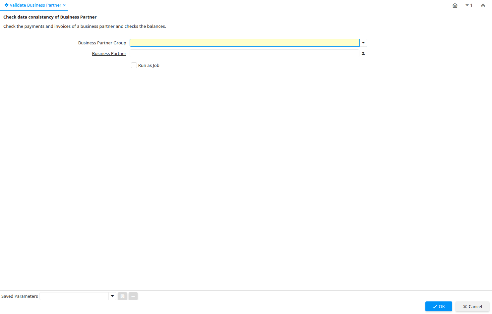

# Validate Business Partner

Process ID 314

*06/01/2005 → 27/05/2013*

**Description:** Check data consistency of Business Partner

**Comment/Help:** Check the payments and invoices of a business partner and checks the balances.

**Classname:** `org.compiere.process.BPartnerValidate`

## Table: Process Parameters

| **Name** | **Description** | **Comment/Help** | **Technical Data** |
|---|---|---|---|
| Business Partner Group | Business Partner Group | The Business Partner Group provides a method of defining defaults to be used for individual Business Partners. | C_BP_Group_ID Table Direct |
| Business Partner | Identifies a Business Partner | A Business Partner is anyone with whom you transact.  This can include Vendor, Customer, Employee or Salesperson | C_BPartner_ID Search |

