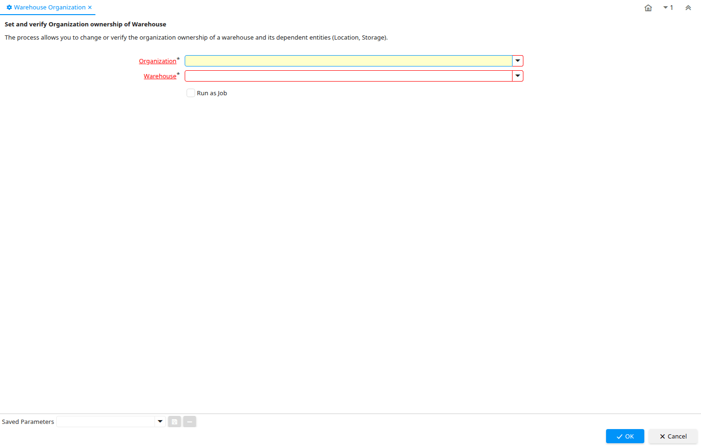

# Warehouse Organization

Process ID 244

*23/12/2003 → 02/01/2000*

**Description:** Set and verify Organization ownership of Warehouse

**Comment/Help:** The process allows you to change or verify the organization ownership of a warehouse and its dependent entities (Location, Storage).

**Classname:** `org.compiere.process.OrgOwnership`

## Table: Process Parameters

| **Name** | **Description** | **Comment/Help** | **Technical Data** |
|---|---|---|---|
| Organization | Organizational entity within tenant | An organization is a unit of your tenant or legal entity - examples are store, department. You can share data between organizations. | AD_Org_ID Table Direct |
| Warehouse | Storage Warehouse and Service Point | The Warehouse identifies a unique Warehouse where products are stored or Services are provided. | M_Warehouse_ID Table Direct |

