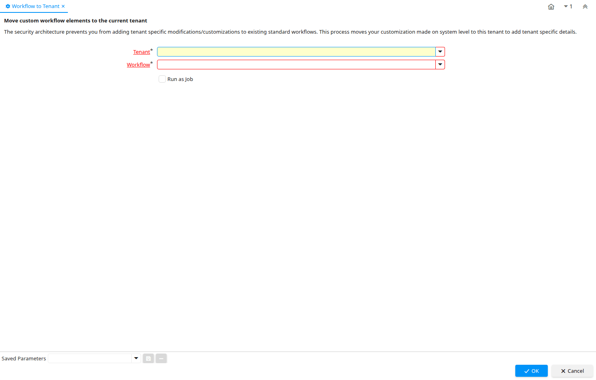

# Workflow to Tenant

Process ID 309

*28/09/2004 → 10/03/2022*

**Description:** Move custom workflow elements to the current tenant

**Comment/Help:** The security architecture prevents you from adding tenant specific modifications/customizations to existing standard workflows.  This process moves your customization made on system level to this tenant to add tenant specific details.

**Classname:** `org.compiere.wf.WorkflowMoveToClient`

## Table: Process Parameters

| **Name** | **Description** | **Comment/Help** | **Technical Data** |
|---|---|---|---|
| Tenant | Tenant for this installation. | A Tenant is a company or a legal entity. You cannot share data between Tenants. | AD_Client_ID Table Direct |
| Workflow | Workflow or combination of tasks | The Workflow field identifies a unique Workflow in the system. | AD_Workflow_ID Table Direct |

