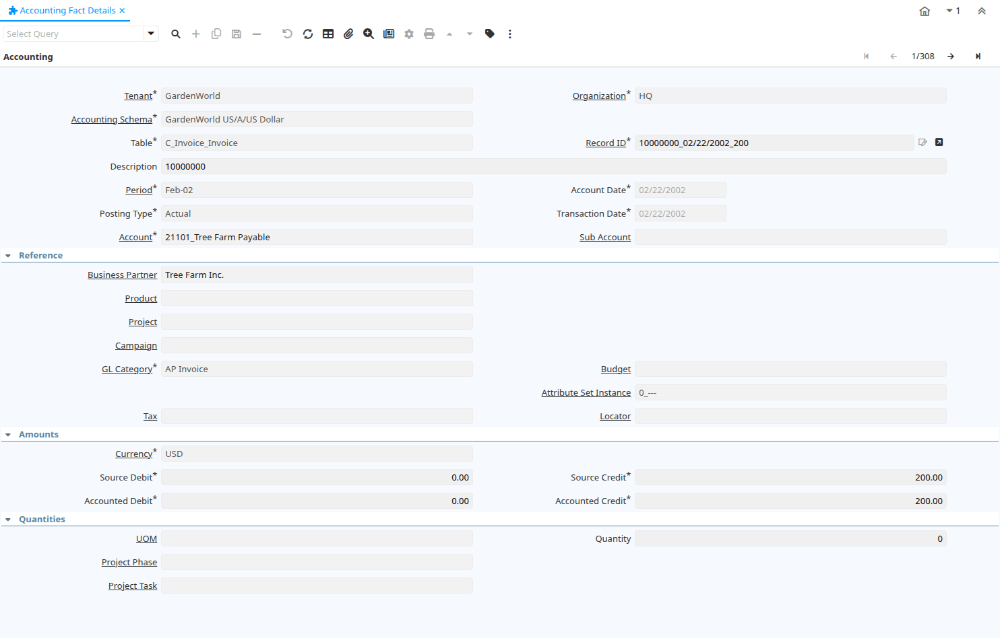

# Accounting Fact Details

Report ID 252

*09/01/2004 → 02/01/2000*

**Description:** Accounting Fact Details Report

**Comment/Help:** Report with detail accounting details.

## Table: Report Parameters

| **Name** | **Description** | **Comment/Help** | **Technical Data** |
|---|---|---|---|
| Accounting Schema | Rules for accounting | An Accounting Schema defines the rules used in accounting such as costing method, currency and calendar | C_AcctSchema_ID Table Direct |
| Organization | Organizational entity within tenant | An organization is a unit of your tenant or legal entity - examples are store, department. You can share data between organizations. | AD_Org_ID Chosen Multiple Selection Table |
| Account Date | Accounting Date | The Accounting Date indicates the date to be used on the General Ledger account entries generated from this document. It is also used for any currency conversion. | DateAcct Date |
| Period | Period of the Calendar | The Period indicates an exclusive range of dates for a calendar. | C_Period_ID Chosen Multiple Selection Table |
| Account | Account used | The (natural) account used | Account_ID Chosen Multiple Selection Table |
| Account Key | Key of Account Element |  | AccountValue String |
| Business Partner | Identifies a Business Partner | A Business Partner is anyone with whom you transact.  This can include Vendor, Customer, Employee or Salesperson | C_BPartner_ID Chosen Multiple Selection Search |
| Product | Product, Service, Item | Identifies an item which is either purchased or sold in this organization. | M_Product_ID Chosen Multiple Selection Search |
| Tax | Tax identifier | The Tax indicates the type of tax used in document line. | C_Tax_ID Chosen Multiple Selection Table |
| GL Category | General Ledger Category | The General Ledger Category is an optional, user defined method of grouping journal lines. | GL_Category_ID Chosen Multiple Selection Table |
| Attribute Set Instance | Product Attribute Set Instance | The values of the actual Product Attribute Instances.  The product level attributes are defined on Product level. | M_AttributeSetInstance_ID Table |
| Charge | Additional document charges | The Charge indicates a type of Charge (Handling, Shipping, Restocking) | C_Charge_ID Table Direct |
| Cost Center |  |  | C_CostCenter_ID Table Direct |
| Department |  |  | C_Department_ID Table Direct |
| Employee | Identifies a Business Partner | A Business Partner is anyone with whom you transact.  This can include Vendor, Customer, Employee or Salesperson | C_Employee_ID Table |
| Warehouse | Storage Warehouse and Service Point | The Warehouse identifies a unique Warehouse where products are stored or Services are provided. | M_Warehouse_ID Table Direct |

