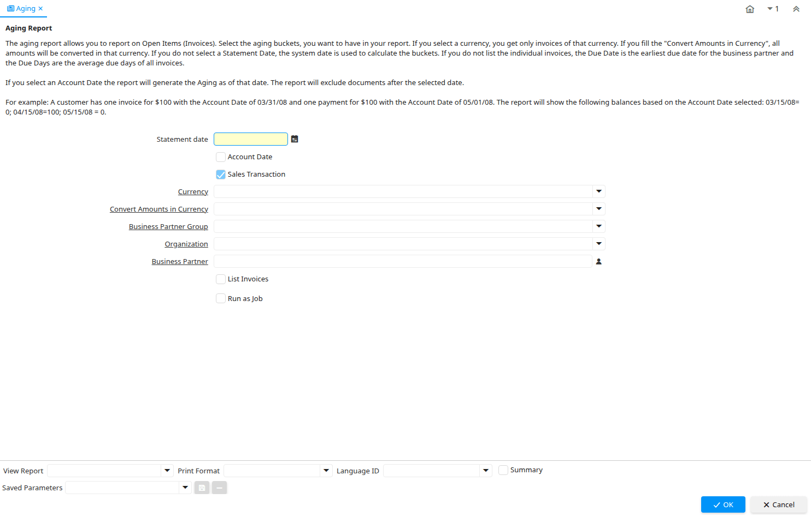

# Aging

Report ID 238

*05/12/2003 → 29/07/2019*

**Description:** Aging Report

**Comment/Help:** The aging report allows you to report on Open Items (Invoices). Select the aging buckets, you want to have in your report. If you select a currency, you get only invoices of that currency.
If you fill the "Convert Amounts in Currency", all amounts will be converted in that currency. If you do not select a Statement Date, the system date is used to calculate the buckets. If you do not list the individual invoices, the Due Date is the earliest due date for the business partner and the Due Days are the average due days of all invoices.&lt;br&gt;
&lt;br&gt;
If you select an Account Date the report will generate the Aging as of that date. The report will exclude documents after the selected date.&lt;br&gt;
&lt;br&gt;
For example: A customer has one invoice for $100 with the Account Date of 03/31/08 and one payment for $100 with the Account Date of 05/01/08. The report will show the following balances based on the Account Date selected: 03/15/08= 0; 04/15/08=100; 05/15/08 = 0.

**Classname:** `org.compiere.process.Aging`

## Table: Report Parameters

| **Name** | **Description** | **Comment/Help** | **Technical Data** |
|---|---|---|---|
| Statement date | Date of the statement | The Statement Date field defines the date of the statement. | StatementDate Date |
| Account Date | Accounting Date | The Accounting Date indicates the date to be used on the General Ledger account entries generated from this document. It is also used for any currency conversion. | DateAcct Yes-No |
| Sales Transaction | This is a Sales Transaction | The Sales Transaction checkbox indicates if this item is a Sales Transaction. | IsSOTrx Yes-No |
| Currency | The Currency for this record | Indicates the Currency to be used when processing or reporting on this record | C_Currency_ID Table Direct |
| Convert Amounts in Currency |  |  | ConvertAmountsInCurrency_ID Table |
| Business Partner Group | Business Partner Group | The Business Partner Group provides a method of defining defaults to be used for individual Business Partners. | C_BP_Group_ID Table Direct |
| Organization | Organizational entity within tenant | An organization is a unit of your tenant or legal entity - examples are store, department. You can share data between organizations. | AD_Org_ID Table Direct |
| Business Partner | Identifies a Business Partner | A Business Partner is anyone with whom you transact.  This can include Vendor, Customer, Employee or Salesperson | C_BPartner_ID Search |
| List Invoices | Include List of Invoices |  | IsListInvoices Yes-No |

